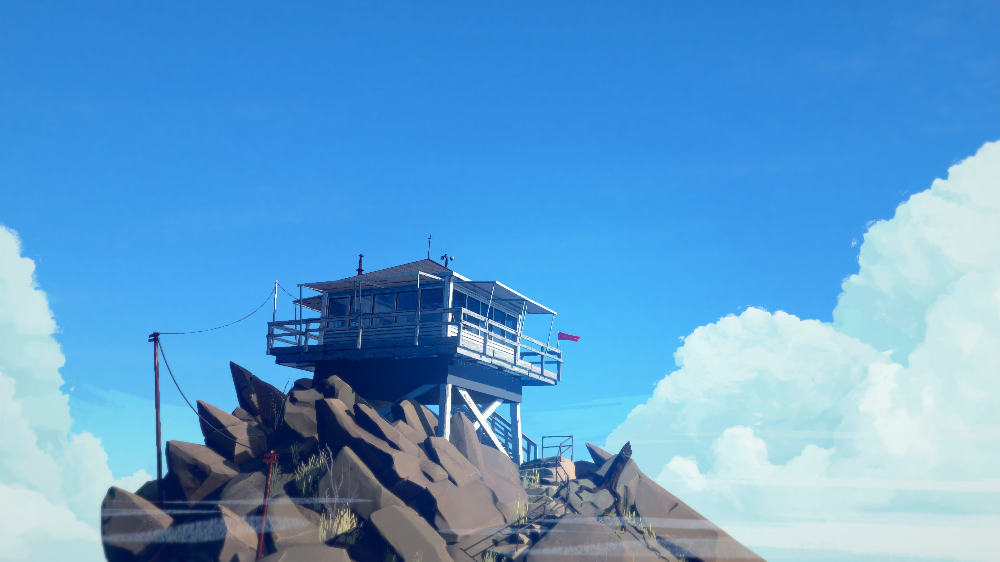

# 「A lookout」 `EN#103`

---

>  [[2022-10-21|21/10/22]]
> 
> #poetry 
> #language/english 
> #poetry/type/free-verse 
> #poetry/rhymed/🔴 
> #poetry/rating/✨✨✨✨✨ 
> #awe #nature #youth #existential #resilience 

---

<a href="https://wallhaven.cc/w/neqwon" class="source-link">source: wallhaven</a>

---

A lookout stood,
far not from my home.
I walked past it
every single day.

Seasons go past.
It stands there unused,
forgotten by
everyone but me.

In spring rains fell,
the wood swelled from them.
A thunderstorm
hit it, but not split.

Then summer came.
Scorched it till it was
dry as tinder.
Strain didn't take it down.

Autumn said "Hi".
Leaves a carpet made.
A beaver took
one of it's four legs.

In winter's hug
the lookout stood out,
but didn't fall down
under heavy blows.

Decades went past,
the lookout still stands,
without a leg,
but just not yet dead.