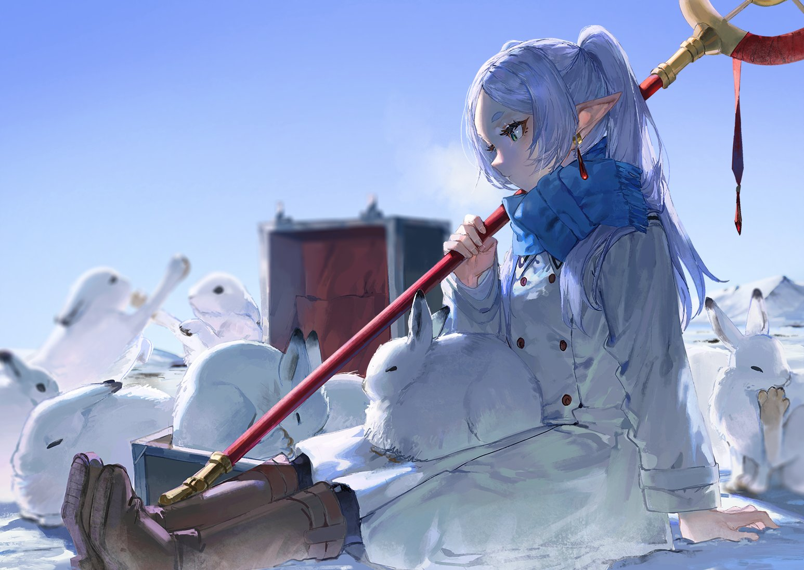

# 「A.N.H.E.D.O.N.I.A.」 `EN#123`

---

> [[2024-01-05|05/01/24]]
> 
> #poetry 
> #language/english 
> #poetry/type/free-verse #poetry/type/short 
> #poetry/rhymed/🔴 
> #poetry/rating/✨✨✨✨✨ 
> #despair #depressive #isolation #sadness #introspection #trapped #lost #existential #pain #longing #resignation #dark #disappointing-reality #futility 

---

All I see is black
Not a light in sight 
Hate this feeling inside
Ever feel like not being alive?
Do your best, and feel your worst
Once brought up, then kicked down thrice 
Not a light in sight, nothing breaks thought the mask
I don't know what to do anymore, I don't even know how to live
And all I can do is lay, with head spinning, with thoughts squirming, alone 