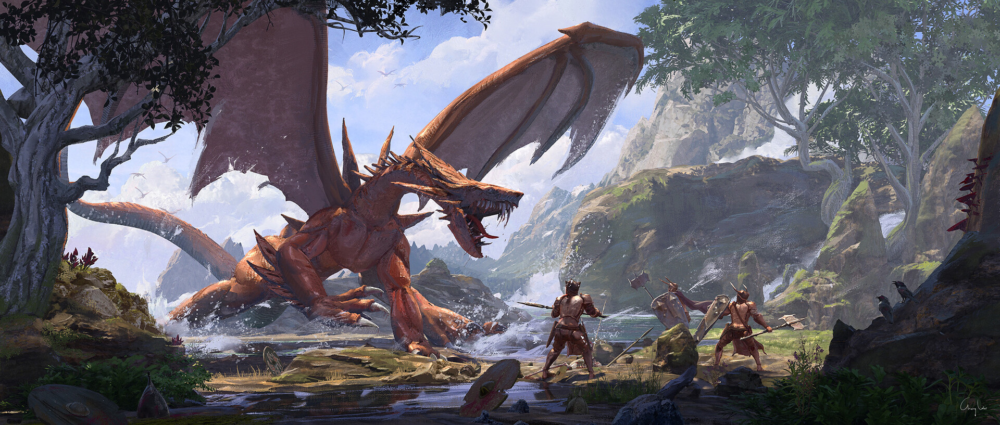

# 「Ailment」 `EN#007`

---

> 22/01/22
> 
> #poetry 
> #poetry/art 
> #language/english 
> #poetry/type/epic 
> #poetry/rhymed/🟡 
> #poetry/rating/⭐⭐⭐ 
> #adventure #courage #death #despair #existential #fiction #grief #hopeful #motivating #mystery #nature #parable #resilience #story #uplifting #wisdom 

---

<a href="https://www.artstation.com/artwork/48b082" class="source-link">source: artstation</a>

---
### Pt. 1 — Despair
Ages ago a terrible disease
Has fallen upon Nallencia.
It's called different names:
Crux, Devish and the Ailment
Are only some of them.

At first no symptoms show,
But soon blue patches appear
On one's skin showing it's spores.
In week notice they turn black
As victims freeze from inside out,
After a month of suffering
Only an ice statue is left,
With a terrified face.

The disease struck right after
The Great War with Abrasia ended,
Leaving the, by then, weak nation,
Weeping is despair.

But...
A Traveler from afar arose
Telling tales of a land
Bathed in warm light
Where frost never comes by.

Quickly the Council declares:
'A party shall set out with the Traveler
To this Wonder-Land to learn,
Of the Power that forbids cold from it,
So it may help to abolish the disease
That on the people befell.'

As the Council enunciated,
A party of brave adventurers
Has been formed.
Thanks to our Lord's help
They've been equipped.

So they departed,
Full of Faith and Hope,
To free their people,
From the shackles of frost.

---
### Pt. 2 — Hope
A new world full of adventure,
Ready to be explored
With friends of virtue.

Peaceful plains
With lots of names,
Full of life,
Of all size.

Winding rivers
Shimmering with silvers,
Jumping carp,
Bear's delight,
The circle of life.

> Dreamy highlands,
> Magnificent badlands,

> Stony pillars,
> Dream of carvers.

> Lush forests,
> Colorful groves.

> Soaring peaks,
> Snaking creeks,

> A narrow pass,
> Deep crevasse.

Ancient ruins ready to be explored,
By brave pioneers without remorse.

But our adventurers have no interest in that.
To the first they meet they tip off their hats,
And ask for the secret of this no-ice land,
They didn't know it but they advised,
To ask the elder who know the future and past.

Adventurers followed his advice,
They found the center of the village
Where a cathedral rose.
The elders welcomed them
Happy to tell the story
Of their people's genesis.

A group of friends founded this city,
And friendship lives in it ever since.

For the destination ain't important,
It's friends we meet that cure us from Ailment.

With the knowledge they collected,
The adventurers prepared for return.

---
### Pt. 3 — Truth
They were attacked
On their way back,
In the land of Zirack
Known as The Brat.
He said to them:

> 'I'll tell you a riddle,
> If none of you guess,
> You will moress.
> What's the meaning of Life?'

The first adventurer
Said right away:
> 'I know the answer,
> I read it somewhere,
> It's forty two - the number.'

> 'You are wrong,
> It's no more than
> A shtick from a book.'

After some thought,
The second one spoke:
> 'The answer is to live happy,
> To enjoy it, help others with that.'

> 'That is wrong.'
> Zirack said,
> I carry the question
> Onto you, last fool'

The third adventurer stood ablaze,
> 'I will not fall for your trick!
> There is no answer,
> As Life is not a question.
> It has neither meaning nor point,
> You only seek it's completion'

> 'You are correct,
> You earned my respect.
> You're free to go,
> Just tell me before,
> What in my land you sought?'

So they told him of their quest,
To fulfill his request.

They returned home,
To rejoice of all.
Their story galloped,
Through the country whole,
People showering in the bliss,
Of knowing a cure for the disease.