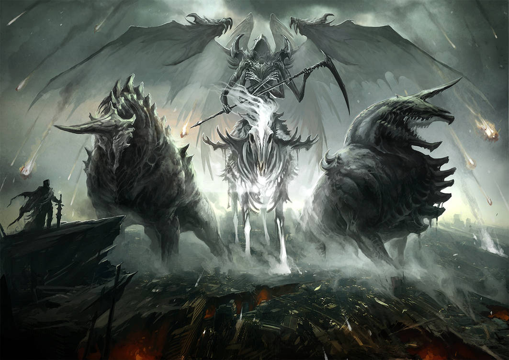

# 「Apocalypse」 `EN#002`

---

> 31/12/21
> 
> #poetry 
> #language/english 
> #poetry/type/free-verse 
> #poetry/rhymed/🔴 
> #poetry/rating/✨✨✨✨✨ 
> #apocalypse #chaos #death #eldritch #existential #fear #fiction #futility #gods #scary #tragedy #wrath 

---

<a href="https://www.deviantart.com/sandara/art/Judgement-144999176" class="source-link">Source: deviantart</a>

---

The Time has come
They are coming
The Seals have been broken
The Apocalypse is here

There's nowhere to run
You can't hide from
The One Who Sees All.
You'll face your Lord's Wrath
The pits of Hell are waiting
For those who are found guilty
Of holding dear only
Money, Power and Influence.
They shall be cast out of the Sky
And face eternal suffering
Like the A̵̡͙̫̽̿̚ń̴̞͔̀͒͜ǵ̸̟͚͌̾e̵̻͔̼͑̚͝l̴̦͓͋͒̕ they follow.
Michael and Azrael shall be stood
Before the Gate and none shall pass
Whom have not received the Sign.
Some will try to fight back
But they will fail
Being no match for the Warriors Of God
Their effort will be remembered by others
To no avail

---

<iframe width="100%" height="166" scrolling="no" frameborder="no" allow="autoplay" src="https://w.soundcloud.com/player/?url=https%3A//api.soundcloud.com/tracks/1165725763&color=%23ff5500&auto_play=false&hide_related=false&show_comments=true&show_user=true&show_reposts=false&show_teaser=true"></iframe>