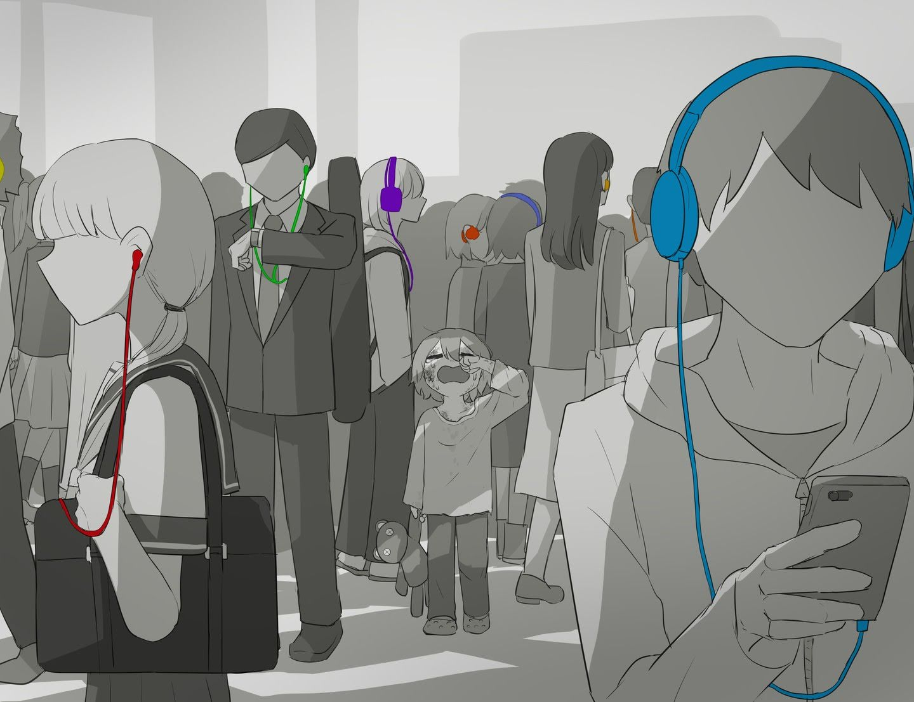

# 「Attention」 `EN#265`

---

> 29/09/24
> 
> #poetry 
> #language/english 
> #poetry/type/free-verse #poetry/type/nonet #poetry/type/short 
> #poetry/rhymed/🔴 
> #poetry/rating/⭐⭐⭐⭐ 
> #isolation #despair #rejection #loss #lost #humanity #social-commentary #betrayal #depressive #dark #existential #cynical #disappointing-reality #dismissive #futility #thought-provoking 

---

People are deaf  
To cries for help  
No one wants to be involved  
No one cares  
Friends leave  
Family abandons  
You're on your own  
So keep it down  
Keep on dyin' slow