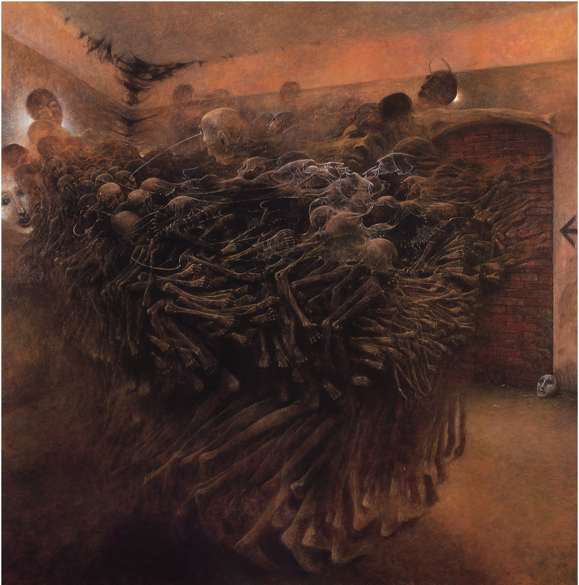

# 「Bone prison」 `EN#155`

---

> 11/04/23
> 
> #poetry 
> #language/english 
> #poetry/type/free-verse 
> #poetry/rhymed/🔴 
> #poetry/rating/✨✨✨✨✨ 
> #despair #depressive #isolation #dark #trapped #existential #death 

---

---

Still conscious,
Still breathing,
Just barely
Believing.
Blood flowing -
Still in veins,
My brain -
Inside my head.

Yet somehow -
I died.
Was it my will?
My conscience? 
Or my soul? 
But I'm dead.
Prisoner of my body,
Prisoner of my mind -
Cannot escape,
Cannot fully die.