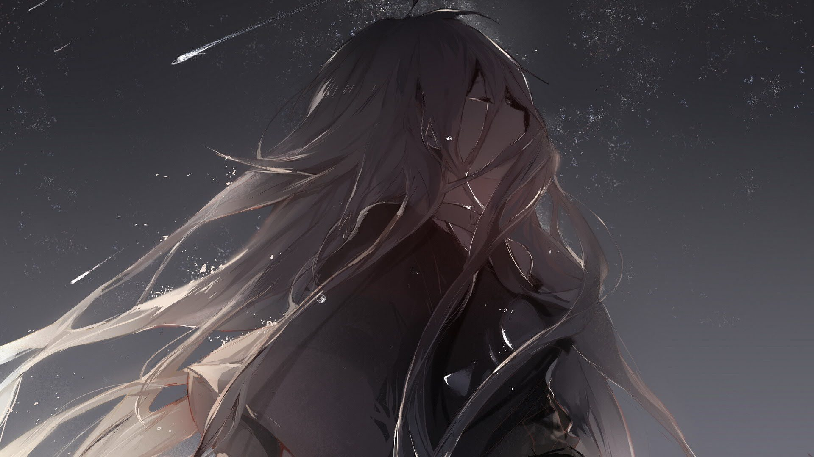

# 「Bryza」 `PL#105`

---

> [[2024-02-19|19/02/24]]
> 
> #poetry 
> #poetry/art 
> #language/polish 
> #poetry/type/free-verse 
> #poetry/rhymed/🟡 
> #poetry/rating/✨✨✨✨✨ 
> #isolation #melancholy #desire #introspection #ephemerality #bittersweet #trapped #lost #resignation #hopeful #longing #resilience #tranquility #existential 

---

---

Spuszczony wzrok
Przepadam w mrok
Cienie tańczą wokół mnie
Szept nocy, cichy jak motyl
Wznosi delikatną bryzę
Która chłodzi moja twarz
Od emocji rozpłonioną

Dookoła gwiazdy trzepoczą
Odwrócić uwagę chcą
Pod powiekami ciemność nie mniejsza
Lecz jakaś taka... łagodniejsza
Za mną zostały sztormy
I gwałtowne bałwany

Chcę tylko uciec na chwilę
Na ledwo sekundkę
Odetchnąć świeżym powietrzem
Zapomnieć, zasnąć
Tylko istnieć przez chwilę