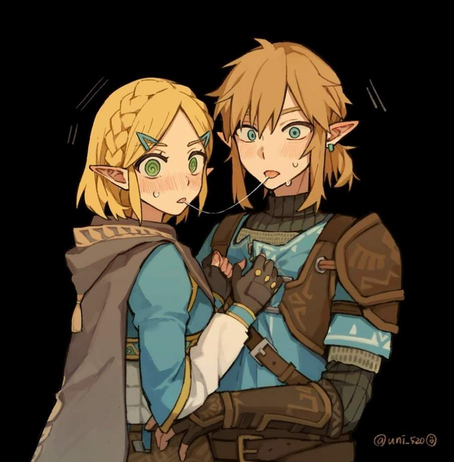

# 「Caught」 `EN#293`

---

> [[2024-11-24|24/11/24]]
> 
> #poetry 
> #poetry/art 
> #language/english 
> #poetry/type/free-verse 
> #poetry/rhymed/🔴 
> #poetry/rating/⭐⭐⭐ 
> #love #bittersweet #determination #loss #melancholy #betrayal #despair #denial #rejection #resilience #duality #humility #desire #guilt #regret #sadness #adventure #death #pain #youth #fate #freedom #wisdom 

---

---

Wha-?
W-why are you here?
T-this is not what it looks like
N-nno, we weren't kissing 
We were... just hugging

And what's with that look in your eye?
Is it not love I see?
If you love him then go
Follow him to hell and back
I give you my blessing
Win this war for us
So your love may flourish