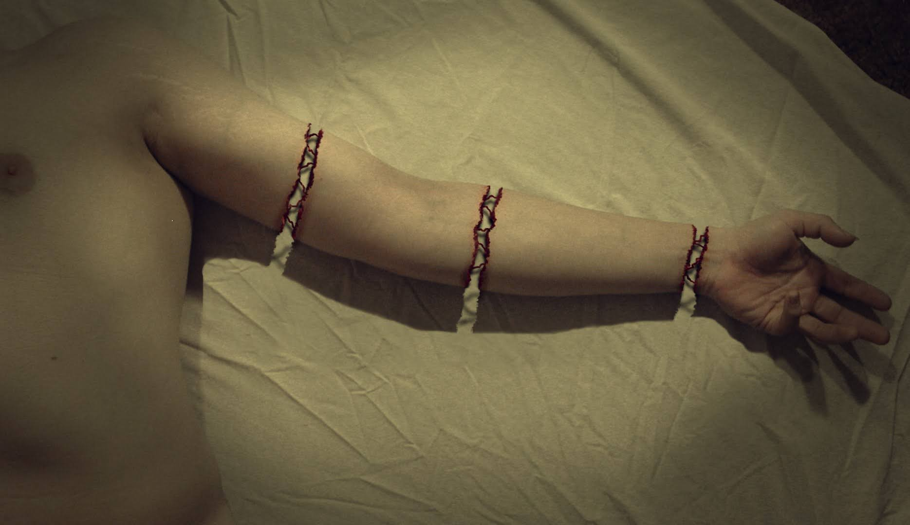

# 「Cierpliwość」 `PL#112`

---

> 03/06/24
> 
> #poetry 
> #language/polish 
> #poetry/type/free-verse #poetry/type/octet #poetry/type/short 
> #poetry/rhymed/🟡 
> #poetry/rating/✨✨✨✨✨ 
> #despair #introspection #dark #resignation #cathartic #pain #isolation #bittersweet #existential #melancholy #comfort #depressive #hopeful #tranquility #death #suicide #profanity #ephemerality #loss 

---

Krew wycieka  
Po ręce ścieka  
Spokój zwiastuje  
Ironia  
Nie tylko nie straszny widok krwi  
Komfort daje on mi  
Co więcej mówić?  
Czekam na koniec cierpliwie