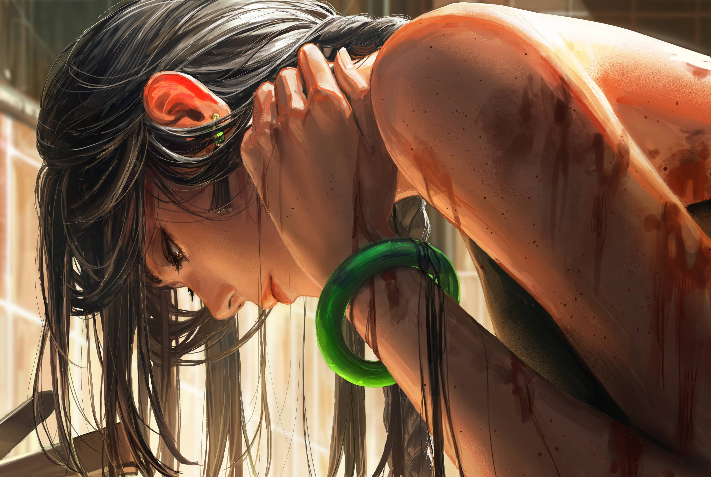

# 「Criss cross」 `EN#233`

---

> [[2024-05-04|04/05/24]]
> #poetry 
> #poetry/art 
> #language/english 
> #poetry/type/free-verse 
> #poetry/rhymed/🔴 
> #poetry/rating/✨✨✨✨✨ 
> #despair #pain #isolation #loss #gods #introspection #futility #regret #cynical #fear #trapped #depressive #profanity #frustration #guilt #hopeful #sadness #rejection #resilience #dark #disappointing-reality #lost 

---

---

The tip of the knife slides effortlessly
Tiny droplets gather 'round the wound
The pain quickly fades away 
I stare at it blankly still
Pleading to feel something
Hoping it'll fix me

The knife draws closer again
Tiny crosses all over my arm
As if the knife was pleading to God
But he doesn't respond
He never responds
To my cries and pleads

What do I do now? 
The blood dried embolding the lines
Do I hide it? Show it?
It feels wrong to be out in the open
But hiding also doesn't feel right
Will I ever be alright?