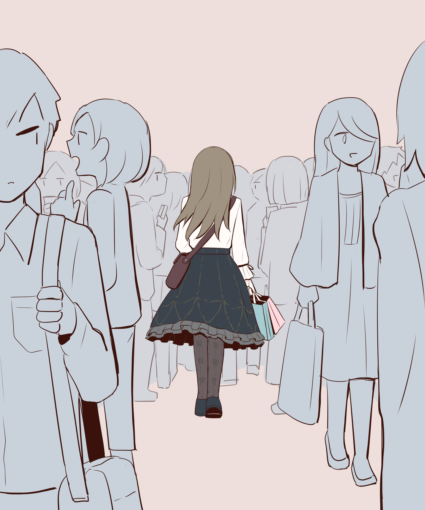

# 「Crowd of strangers」 `EN#261`

---

> 29/09/24
> 
> #poetry 
> #language/english 
> #poetry/type/free-verse #poetry/type/cinquain #poetry/type/short 
> #poetry/rhymed/🔴 
> #poetry/rating/⭐⭐⭐⭐ 
> #loss #melancholy #longing #resignation #nostalgia #depressive #love #sadness #change #regret #disappointing-reality #ephemerality #isolation 

---

I scan the crowd hunting for the face I know  
Not finding it I remember —
You've changed, you're not the same  
It's all in the past  
You're not coming back