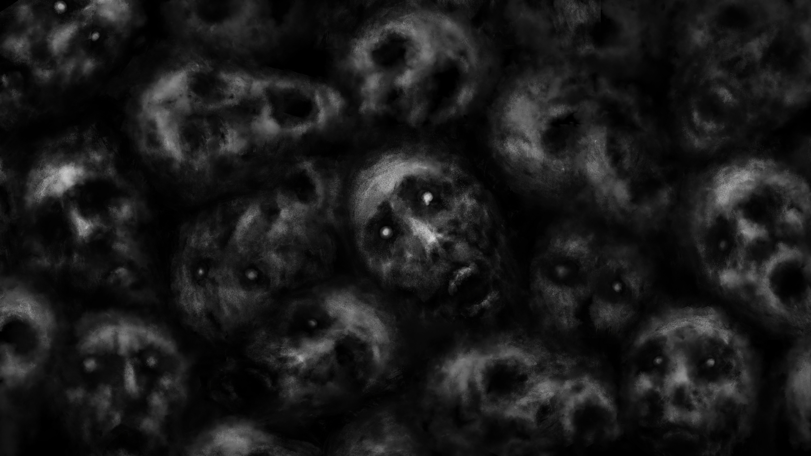

# 「Death's Sonnet」 `EN#044`

---

> [[2022-05-17|17/05/22]]
> 
> #poetry 
> #language/english 
> #poetry/type/sonnet 
> #poetry/rhymed/🔴 
> #poetry/rating/✨✨✨✨✨ 
> #dark #death #despair #frustration #gods #oblivion #pain 

---

<a href="https://stock.adobe.com/pl/images/dark-faces-of-corpses-the-screaming-black-and-white-background-illustration-in-horror-fantasy-genre-coal-and-noise-effect-gloomy-characters-from-nightmares/318414087" class="source-link">source: adobe stock</a>

----

in the hot fiery depths of Hell's abyss
where your screams in vein can no more be heard 
you ask the devil -- when will the pain end?
and hear -- when all of the existence ends

deep in the empty & dark Underworld
another endless and eternal abyss
a squeaky voice can be heard
from Tartarus -- when will their sick reign end

in the Norse Niflheim where Hel exacts cold rules
where darkest souls wait shrouded in dark mist
wherein is the end? where's the Ragnarök?
we want to fight and kill Valhalla's sons

   why every soul asks of the end of time
   Death says -- I'm tired of this, cut the crap