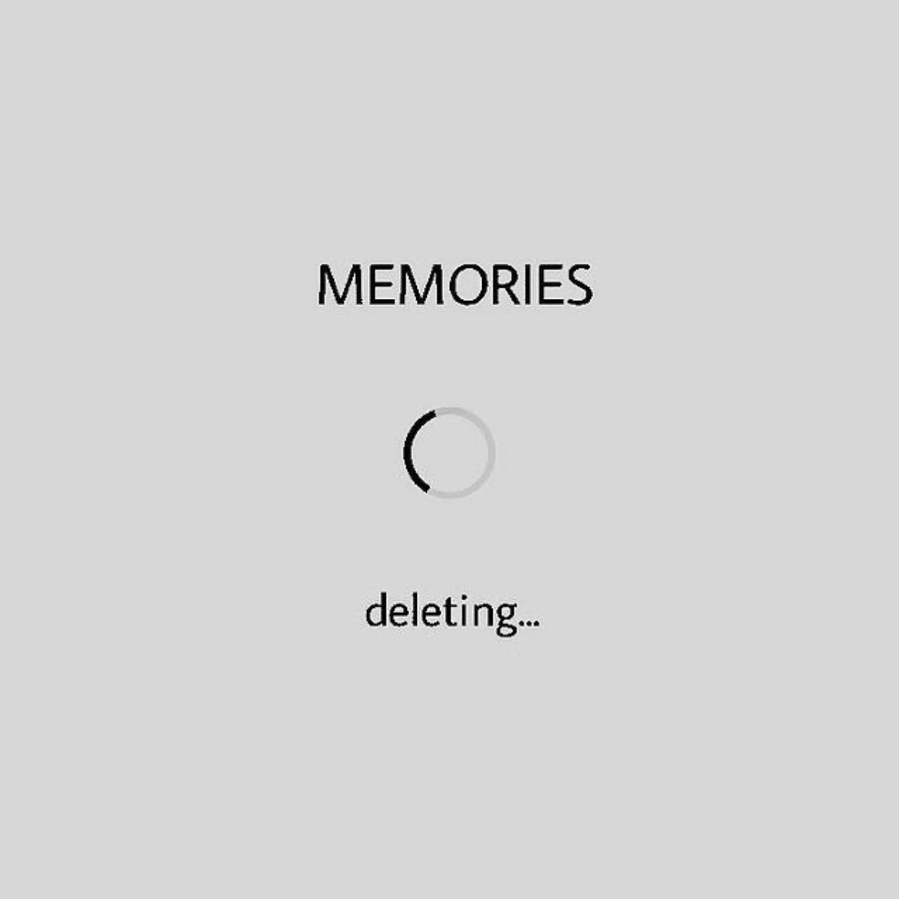

# 「Deleting...」 `EN#294`

---

> 24/11/24
> 
> #poetry 
> #language/english 
> #poetry/type/free-verse 
> #poetry/rhymed/🔴 
> #poetry/rating/✨✨✨✨✨ 
> #despair #frustration #loss #pain #isolation #trapped #futility #melancholy #chaos #existential #gods #introspection #betrayal #cathartic #depressive #desire #grief #longing #love #wrath #random #resignation #weird #whimsical #disappointing-reality #insanity 

---

---

Finally! 
I can access the button!
I can delete my memories of you! 

\> Delete! 
\> Confirm!

Loading…
█▒▒▒▒▒▒▒▒▒

Loading…
███▒▒▒▒▒▒▒

Loading…
█████▒▒▒▒▒

Loading…
███████▒▒▒

Almost done...
██████████

\[Error]: You do not have permission to modify this file
Please contact your administrator [GOD]

Fuck!

No no no...
Don't do this to me 
It was supposed to be over
You promised I would be fine
I can't take this anymore
The memories...
They hurt more and more
Please...
Let me forget...