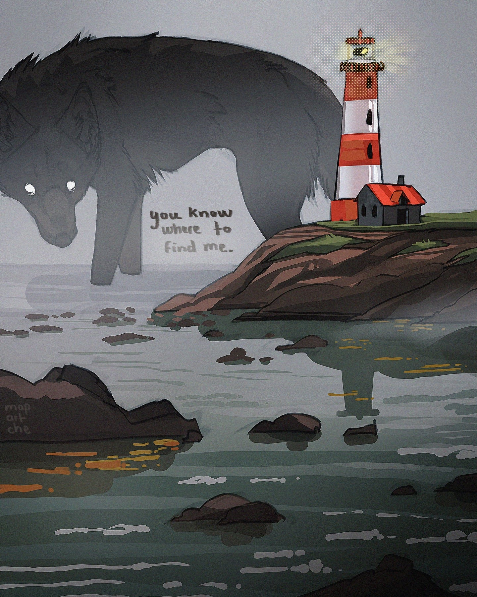

# 「Find me」 `EN#270`

---

> 04/10/24
> 
> #poetry 
> #language/english 
> #poetry/type/free-verse 
> #poetry/rhymed/🟡 
> #poetry/rating/⭐⭐⭐⭐ 
> #isolation #despair #regret #loss #lost #existential #trapped #dark #resilience #futility #depressive #melancholy #dark #determination #disappointing-reality 

---

You know where to find me  
On the edge of the world’s last breath  
Where the sea whispers secrets  
And the rocks wear the weight of regrets  
  
I wait beneath the shadow of the storm  
My howls lost to the waves  
The lighthouse blinks, a distant pulse  
But it never shines my way  
  
The land grows colder, the wind more cruel  
And I remain, unyielding  
A ghost upon this forgotten shore  
Where time has no meaning, no feeling  
  
The light keeps turning  
But never for me—  
You know where to find me  
But will you ever see?