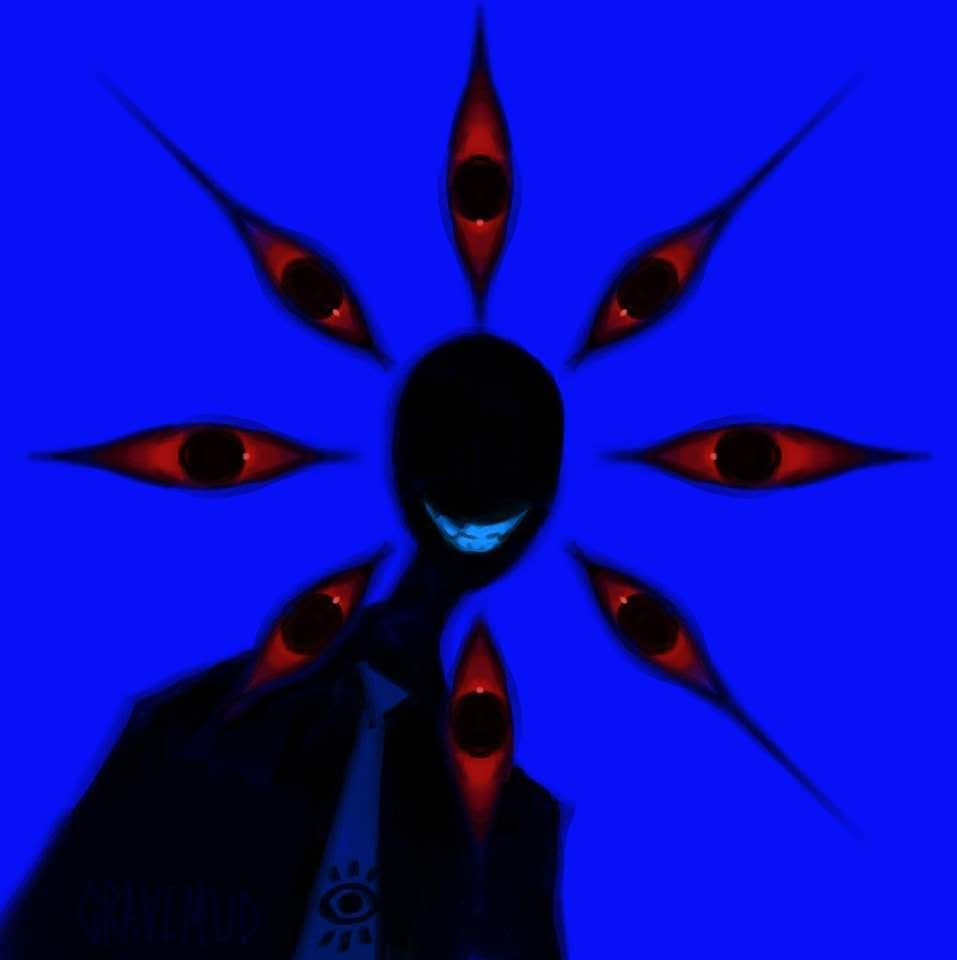

# 「Friend」 `EN#260`

---

> [[2024-09-29|29/09/24]]
> 
> #poetry 
> #language/english 
> #poetry/type/free-verse 
> #poetry/rhymed/🔴 
> #poetry/rating/⭐⭐⭐⭐ 
> #weird #whimsical #eldritch #cynical #desire #dark #scary #mystery #insanity #isolation 

---

Smile, silly  
No need to worry  
I don't deal in chicanery  
Only in souls, darling  
  
It's a fair trade, you see?  
I get your soul  
You get what you wish  
See what I mean?  
  
You want to be free from reality  
And I can arrange that dear  
We both get what we want  
What is there to think about?

Ah, thank you very much
I'm always happy to help
Now hop on in
I hope you enjoy your stay with me