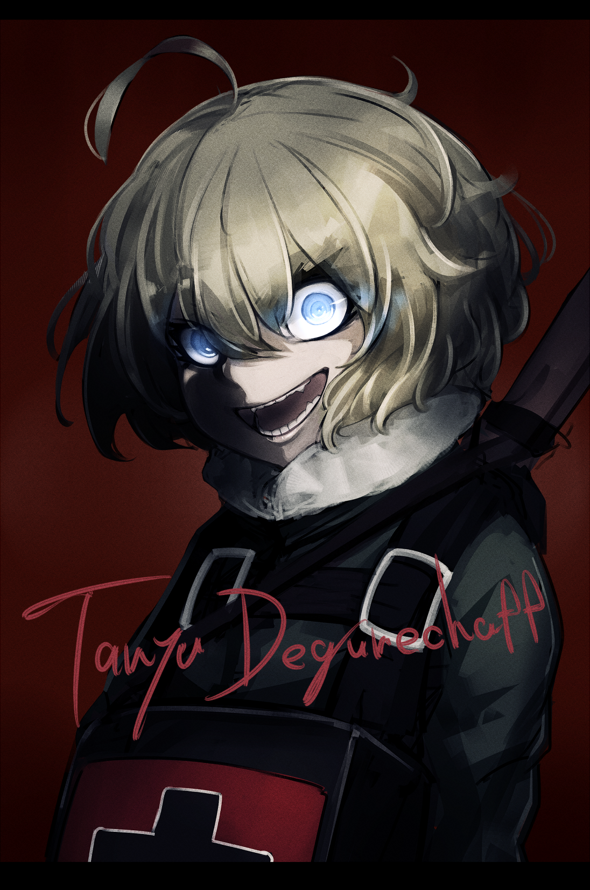

# 「Gauntlet of revenge 1/3: E-V-I-L」 `EN#168`

---

> 08/06/23
> 
> #poetry 
> #poetry/art 
> #poetry/music 
> #language/english 
> #poetry/type/free-verse 
> #poetry/rhymed/🔴 
> #poetry/rating/⭐⭐⭐ 
> #betrayal #dark #death #love #determination #wrath #rejection #revenge #cathartic 

---

[オ](https://www.pixiv.net/en/users/6704636)

----

You left me in a ditch for dead
And her to rot from what you said
This time you crossed the line
I won't show mercy no more
'Cause...

You're E-V...🫢 E-V-I-L 😮‍💨
Won't help you no more
'Cause we're not friends 
You better run away

I know it's not your fault
You were raised this way
But I just don't care
Since you thought it was ok
'Cause...

You're E-V...🫢 E-V-I-L 😮‍💨
You better run away
I won't stop the chase
Until you meet your end

You let yourself hurt me
You know how I am
When I've had enough
And now you'll pay
'Cause...

You're E-V...🫢 E-V-I-L 😮‍💨
Won't help you no more
'Cause we're not friends 
You better run away

---

Listen to: Aviva - evil