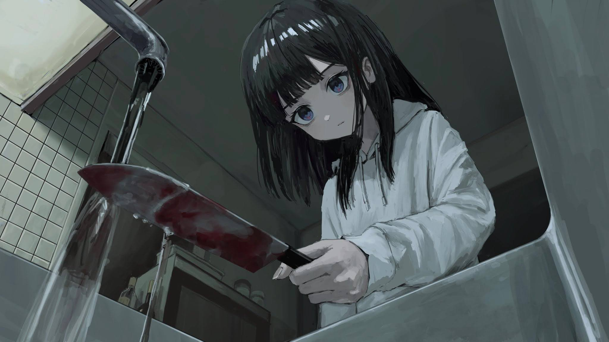

# 「Goodnight」 `EN#224`

---

> [[2024-03-21|21/03/24]]
> 
> #poetry 
> #poetry/art 
> #language/english 
> #poetry/type/free-verse 
> #poetry/rhymed/🔴 
> #poetry/rating/✨✨✨✨✨ 
> #despair #depressive #resignation #trapped #sadness #isolation #pain #introspection #cathartic #guilt #death #rejection #suicide #story #tranquility #dark #existential #profanity #disappointing-reality #determination #ephemerality #futility #thought-provoking 

---

---

'I am too young to die
But I'm too innocent to live'
Her thoughts rang in the silence
She didn't even cry today
She couldn't anymore
The tears wouldn't flow
Even if she wanted them to

'Why can't I do anything right
Why doesn't my body listen to me?'
She was doing her best
But it didn't matter to the world
Only results matter here
And she couldn't even do THIS right

'I don't want this...
I don't wantthis, idon'twantthis —
But I can't stop now, can I?
At least I need to finish this
If nothing else...'
Her hand trembling
She put another
Red, flowing line on her arm...
And another
Another
One more
And one last one

Now she can finally fall asleep...
Goodnight, sweet child...

---

https://www.instagram.com/reel/CrHU6PhpZWd/?igshid=NjZiM2M3MzIxNA==