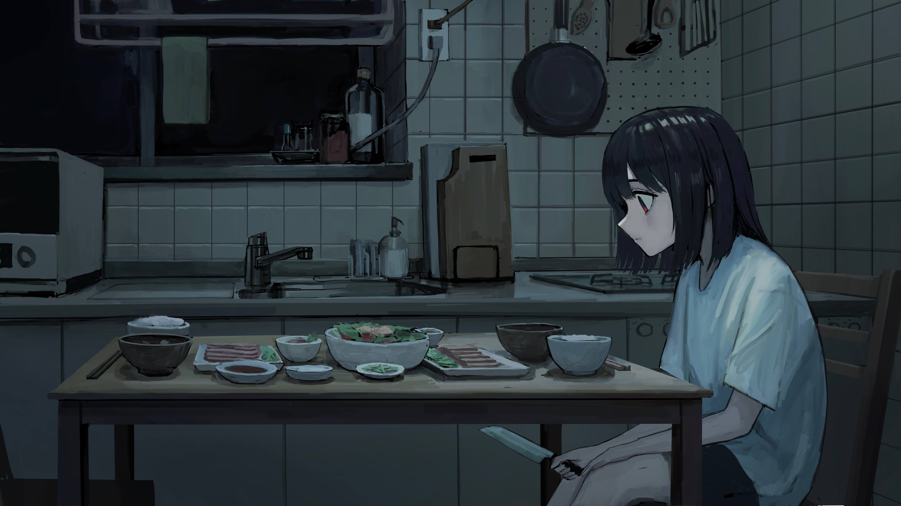

# 「Grey」 `EN#223`

---

> [[2024-03-21|21/03/24]]
> 
> #poetry 
> #poetry/art 
> #language/english 
> #poetry/type/free-verse 
> #poetry/rhymed/🟡 
> #poetry/rating/✨✨✨✨✨ 
> #depressive #despair #melancholy #loss #lost #isolation #dark #trapped #introspection #resilience #disappointing-reality #sadness #decay #existential #futility 

---

---

You wake up every day
To a world full of grey
Where colors decay
And fade away
The sun shines on an empty land
And all you see is bland and bland

Nowadays clouds hang above you
And everything feels dull and blue
The beauty of life
Is lost in your eyes
You constantly struggle
To see past the lies

The sun still rises, but... it's kinda dim
And shadows seem to creep and skim
Your heart feels heavy, hard to bear
As if life's lost its love and care
Each step's a chore, each breath a strain
Depression's weight is an endless chain