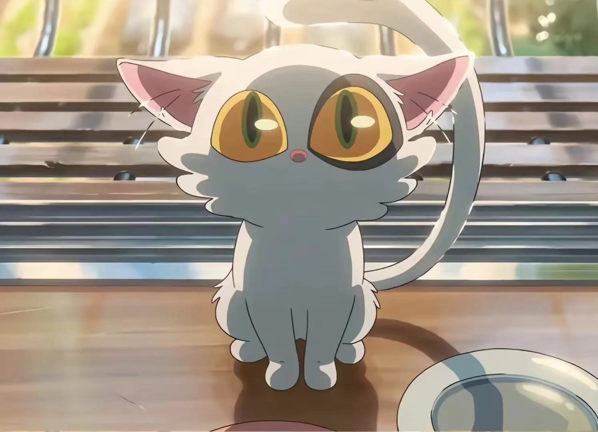

# 「Hooman」 `EN#114`

---

> 04/11/22
> 
> #poetry 
> #language/english 
> #poetry/type/free-verse 
> #poetry/rhymed/🔴 
> #poetry/rating/⭐⭐⭐⭐ 
> #uplifting #motivating #love #isolation #depressive #existential #whimsical 

---

---

My hooman is laying in bed all day
Again.
Hooman, let me butt in, take a break.
It won't hurt you to show me affection,
I'm not like people, I wouldn't shove you aside
Even if I could.
You have to take the trash out sometimes,
Or mold will poison your heart.

Put a smile on your face,
Even if insincere, it still helps.
Come on, let's go to the kitchen,
Make some munchies for you and me.
We can watch a movie or two.
Anything to stop overanalyzing
Everything.

—Your Best Friend