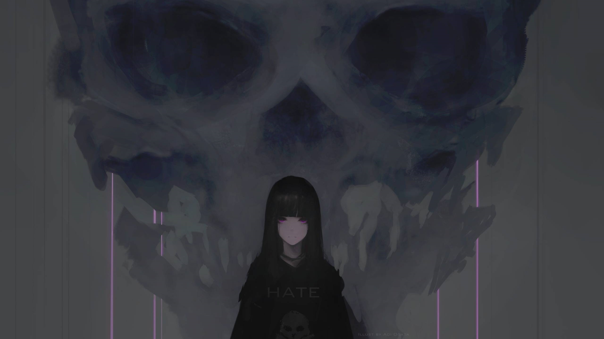

# 「I hate everything about you」 `EN#231`

---

> [[2024-04-28|28/04/24]]
> 
> #poetry 
> #language/english 
> #poetry/type/free-verse 
> #poetry/rhymed/🔴 
> #poetry/rating/✨✨✨✨✨ 
> #betrayal #love #frustration #desire #bittersweet #introspection #isolation #duality #regret #existential #despair #wrath #pain #rejection #profanity #cynical #loss 

---

---

I.
Hate.
Everything.
About you.

If you are what you eat,
You must have eaten some shit.
I hate what you became,
Into a demon you have changed.
An angel and a demon,
Cannot be together, so they say.

So,
Tell me.
Why do I love you?
Tell me why —
Do I still
Love you?