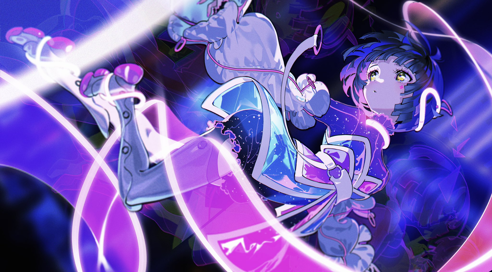

# 「I♡U」 `EN#008`

---

> [[2024-05-28|28/01/22]]
> 
> #poetry 
> #language/english 
> #poetry/type/free-verse 
> #poetry/rhymed/🟢 
> #poetry/rating/✨✨✨✨✨ 
> #comfort #despair #hopeful #longing #love #uplifting 

---

<a href="https://x.com/yoneyamai/status/1406604378170032147" class="source-link">source: x</a>

---

My life's a mess
Worse then chess
But with You
I might just get through

Your eyes let me forget
The things I've done and said
In Your voice
I find rejoice

You're the reason I'm full of life
Thanks to you I feel alive
When I'm close to You
I have worries few

Please don't leave me alone
When I need you the most
I'm sure that together with You
I can make it through

---

<iframe width="700" height="400" src="https://www.youtube-nocookie.com/embed/0FDeOZD0HSU" title="YouTube video player" frameborder="0" allow="accelerometer; autoplay; clipboard-write; encrypted-media; gyroscope; picture-in-picture; web-share" allowfullscreen></iframe>