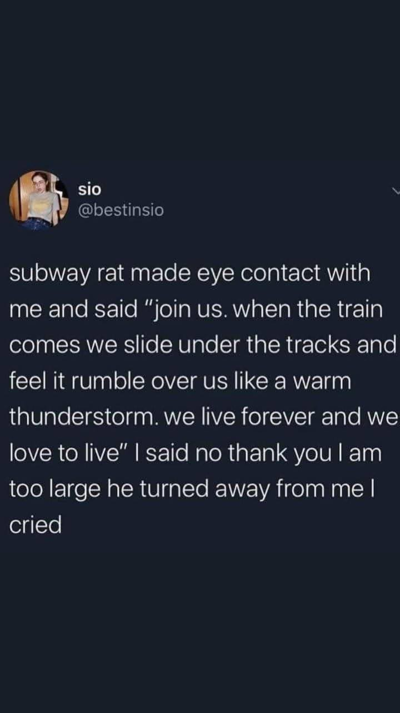

# 「name」 `EN#000`

---

> 01/01/70
>  
> #poetry
> #language
> #poetry/type
> #poetry/rhymed
> #poetry/rating
> keywords

---

image

<a href="https://" class="source-link">Source: </a>

---

03/12/24

  

Last night at the metro

A thing happened like so

In the dimmed lights

And moving shadows of the night

A rat approached me from the side

It sat on its hind, said something along the lines:

"Join us brother. When the train comes

We slither onto the tracks

To feel the rumble pass over us

Like a summer thunderous night.

We live forever, no laws apply

Only one - of mother nature - survive."

I thank him for the offer kind

But turned it away without mind

He looked with sadness in it's eyes

"Goodbye brother, we respect your lies"

And ran away, and I cried