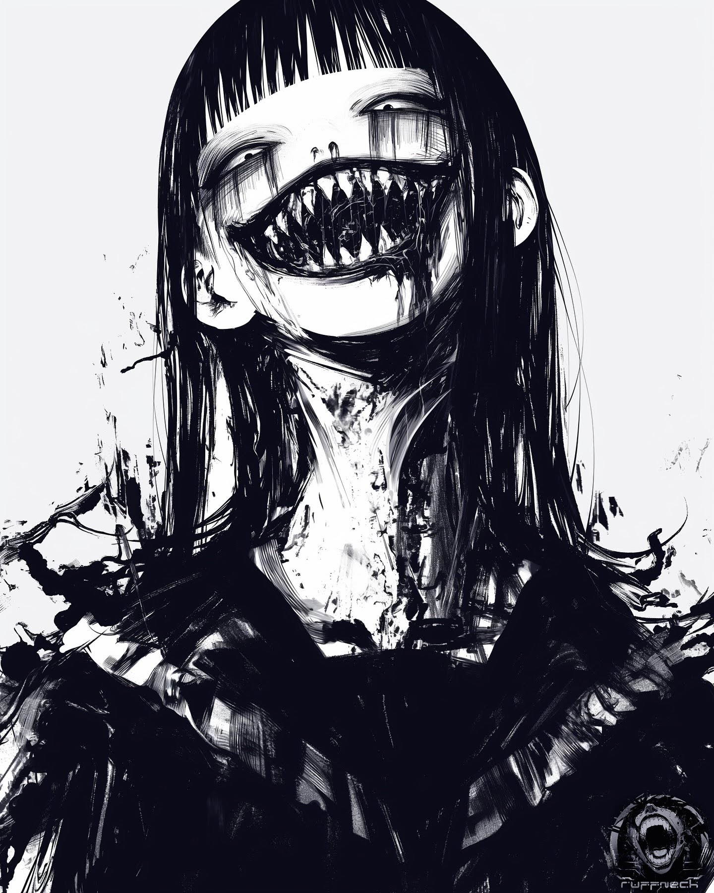

# 「Kuchisake」 `EN#267`

---

> 04/10/24
> 
> #poetry 
> #language/english 
> #poetry/type/free-verse 
> #poetry/rhymed/🔴 
> #poetry/rating/✨✨✨✨✨ 
> #weird #scary #dark #chaos #desire #eldritch #melancholy #insanity 

---

Darling, my love  
Do you like it when I smile?  
Come for a kiss  
Let's have some fun  
  
You don't mind the teeth  
The jagged edge, right?  
Mind if I test their sharpness?  
Joking, I know you don't mind  
  
Let's dance under the stars  
In this twisted, grim night  
Your blood is sweeter still  
When bathed in moon's light