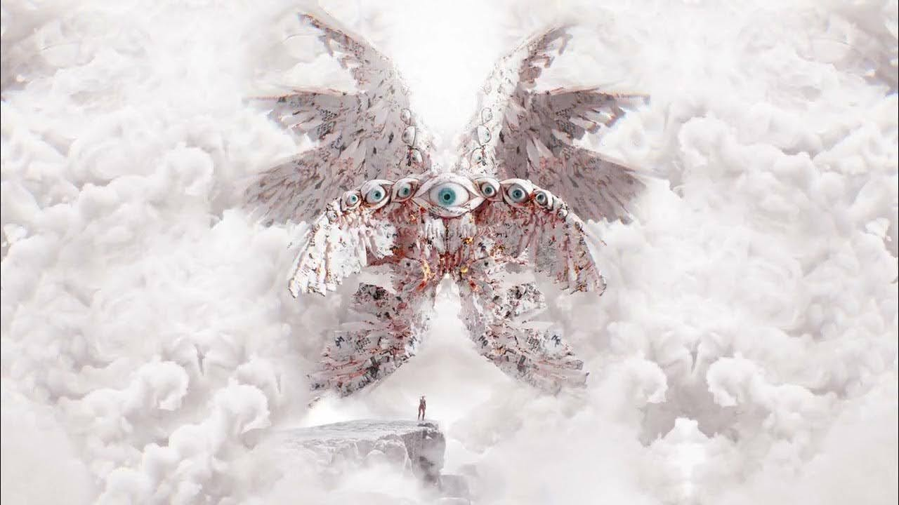

# 「Mercy」 `EN#259`

---

> 29/09/24
> 
> #poetry 
> #language/english 
> #poetry/type/free-verse #poetry/type/short 
> #poetry/rhymed/🟡 
> #poetry/rating/⭐⭐⭐⭐ 
> #gods #despair #loss #isolation #resignation #dark #depressive #guilt #melancholy #sadness #regret #cosmic #weird #random #existential #determination #disappointing-reality 

---

I watch You in your sleep  
I watch You when you weep  
All too long I've watched Your hurt  
All too long I've watched **this** earth  
  
Time to end it all  
Time to let You all go  
Time to wipe the slate clean  
Time to... set You all finally free  
and start again