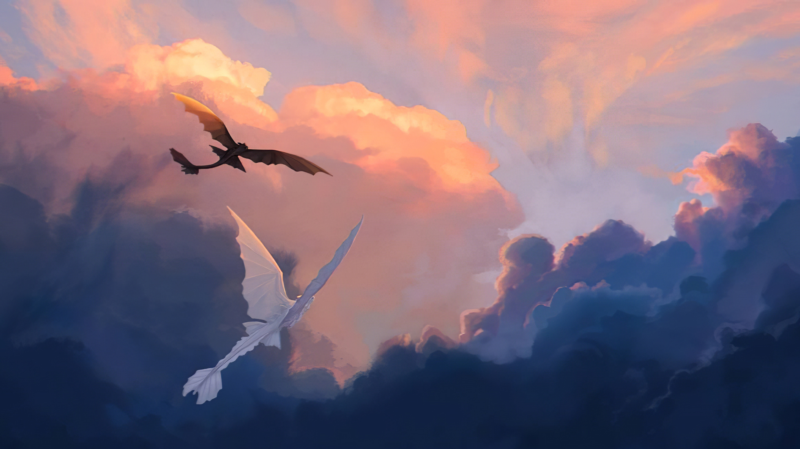

# 「Nocna Furia」 `PL#020`

---

> [[2022-06-15|15/06/22]]
> 
> #poetry 
> #language/polish 
> #poetry/type/alexandrine
> #poetry/rhymed/🔴 
> #poetry/rating/⭐⭐ 
> #story #fiction 

---

<a href="https://alaeries.tumblr.com/post/174638428841/let-the-wind-carry-us-im-real-excited-for" class="source-link">source: tumblr</a>

---

> Dla Teresy

W wielkiej, światłej grocie, smok czarny smacznie śpi
Na tronie z kryształu, spędza swe wszystkie dni
Pełni wciąż funkcję alfy, beta się mu nie śni
Gdy ta majestatyczna, forma jego stanie
Wraz słuchy swoje naraz, wszystkie smoki stawią
Słyszy krzyki wojenne, setki lub tysięce
Wzywa wszystkich dojrzałych, kieruje na szańce
Wiele lat minęło już, odkąd Czkawka zasnął
Snem wiecznym i bezzwrotnym, ludziom odbiło znów
"Cóż począć?" myśli Szczerba, "Walczyć nie wypada."
I w swym pomyślunku, każe wszystkim smokom
Gdy ryk sygnałowy da, skrzyżować oddechy
Jak się oddechy stykały, to łuna się stała
Taka że jaśniej biła, niż zenit słonica
Ludzie w strach popadli, do wioseł się brali
Jakby im życie przeszło, przed duszy oczyma
Tak więc wojna zażegnana, na lat parę była
Lecz gdy wybije godzina, wojna będzie wielka