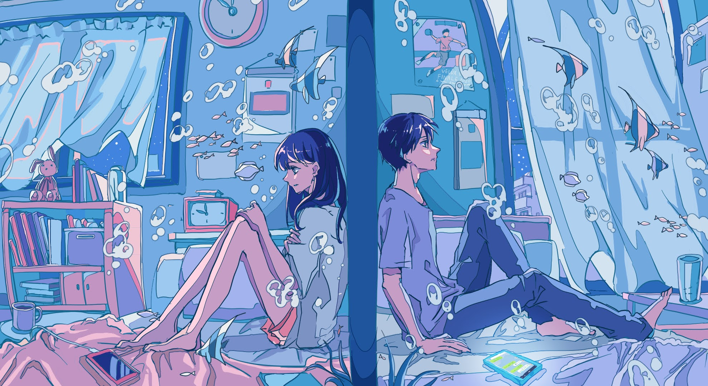

# 「Past」 `EN#225`

---

> [[2024-03-25|25/03/24]]
> 
> #poetry 
> #language/english 
> #poetry/type/free-verse #poetry/type/short 
> #poetry/rhymed/🔴 
> #poetry/rating/✨✨✨✨✨ 
> #betrayal #loss #sadness #bittersweet #despair #wrath #resilience #introspection #melancholy #cathartic #love #pain #rejection #courage #existential #freedom #wisdom #disappointing-reality #ephemerality 

---

---

We thought it would last forever
But you are not the person I loved
And I am not your stepping stone
My patience has bounds
And trust is earned

You are my worst nightmare
A demon in sheep's cloth 
Past left a ghost
Haunting day and night
This is a goodbye to us