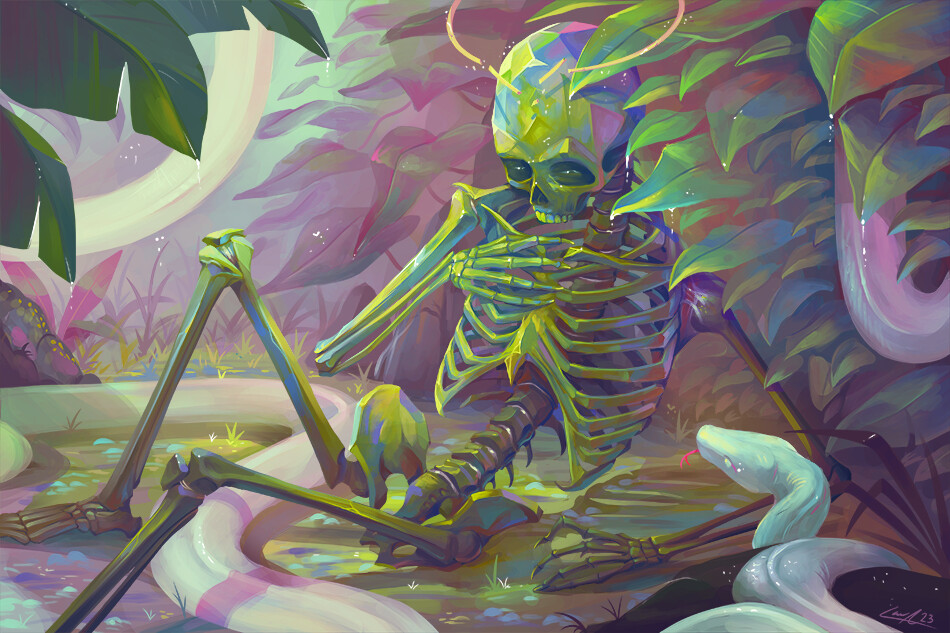

# 「name」 `EN#000`

---

> [[1970-01-01|01/01/70]]
>  
> #poetry
> #language
> #poetry/type
> #poetry/rhymed
> #poetry/rating
> keywords

---

image

<a href="https://" class="source-link">Source: </a>

---

04/03/25

  

https://www.artstation.com/artwork/vJl53d

Death - my love

Please embrace me -

I'm too cold

You're my only safe space 

Do you wish for me to join you already?

Do you not want me to survive a few more day?

Do you not want me to push through for a few more years?

Because I do not. I don't want to hurt anymore

But I cannot go without your consent