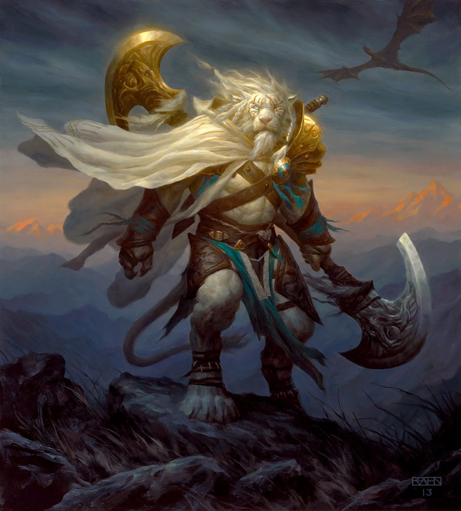

# 「Reinawr」 `EN#004`

---

> 04/01/22
> 
> #poetry 
> #language/english 
> #poetry/type/free-verse #poetry/type/short 
> #poetry/rhymed/🔴 
> #poetry/rating/⭐⭐⭐ 
> #betrayal #dark #death #fiction #gods #isolation #revenge #story #wrath 

---

<a href="https://www.rahnart.com/work/ajani-steadfast" class="source-link">source: rahnart</a>

---

Betrayed by his brothers,
He seeks revenge.
For he may have lost,
His God has not withdriven
His auspice, 'n' thus His powers
Remain for use by him.

But, he must not hurry
For revenge is best served
Cold as the bodies of his enemies