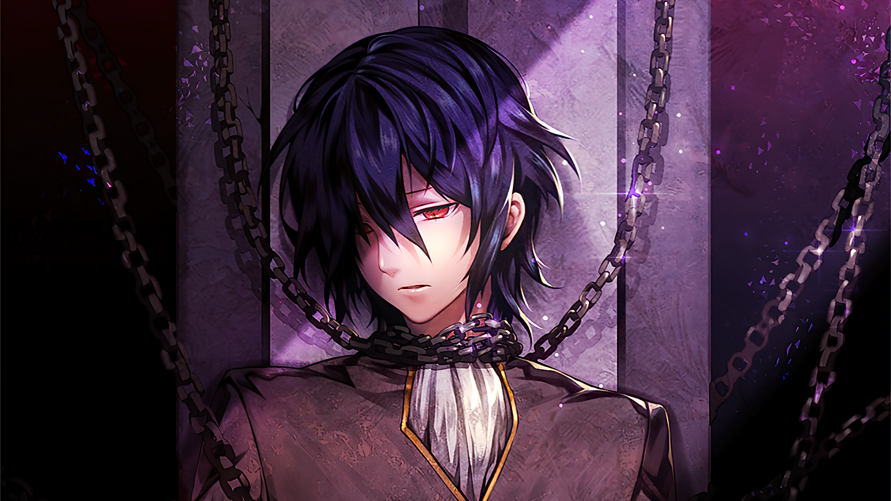

# 「Shackled」 `EN#246`

---

> 19/08/24
> 
> #poetry 
> #language/english 
> #poetry/type/free-verse 
> #poetry/rhymed/🔴 
> #poetry/rating/✨✨✨✨✨ 
> #trapped #despair #isolation #dark #existential #death #futility #depressive #fear #hopeful #resignation #sadness #humanity #social-commentary #disappointing-reality #insanity #lost #thought-provoking 

---

---

Chains everywhere.  
  
Can't look up —
Only down  
At the ground,  
Scorched, cracked,  
Blighted and battered.  
  
Can't see, but feel —
Giants stomping all around.  
Can't see, but hear —
Others' squashed sounds.  
  
Chained, can't move,  
Run or fight;  
Awaiting a saviour,  
Or Death, to come.