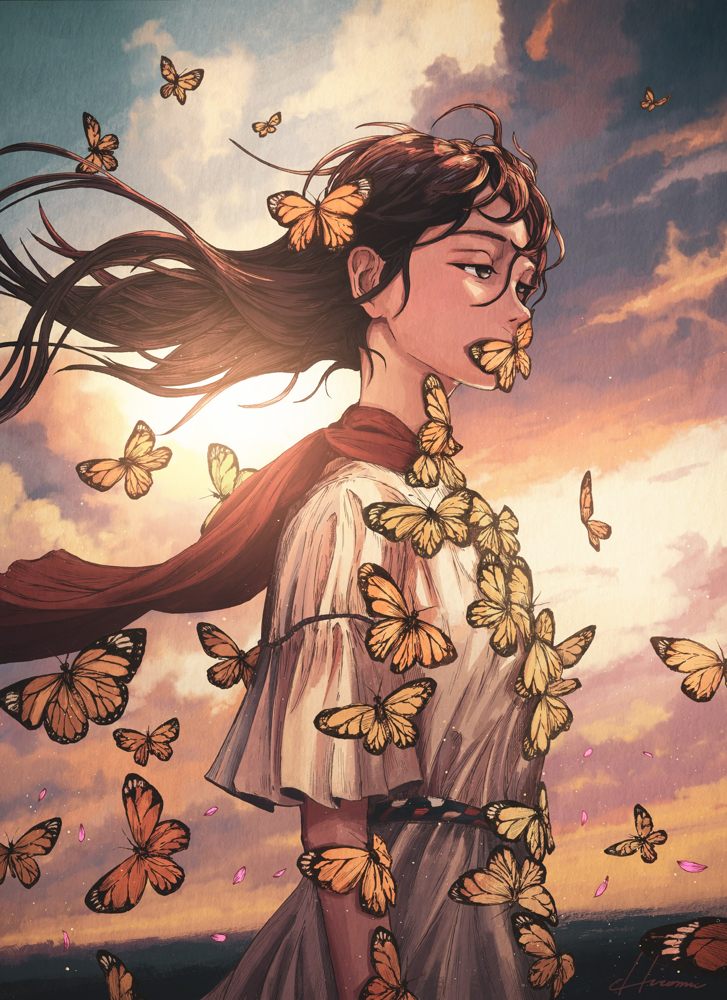
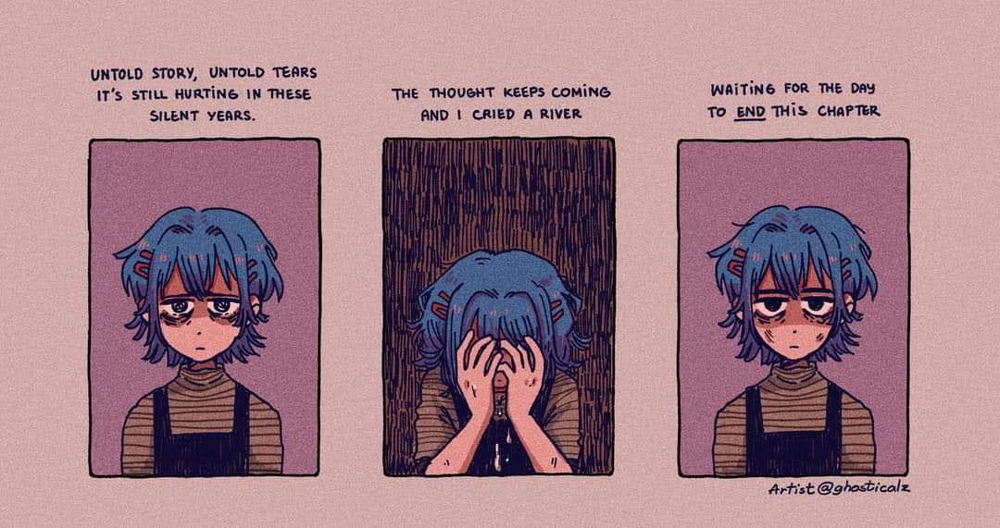

# 「Silent」 `EN#258`

---

> [[2024-09-29|29/09/24]]
> 
> #poetry 
> #language/english 
> #poetry/type/free-verse #poetry/type/octet #poetry/type/short 
> #poetry/rhymed/🔴 
> #poetry/rating/⭐⭐⭐⭐ 
> #despair #longing #sadness #regret #isolation #cathartic #depressive #pain #resilience #disappointing-reality #introspection #loss #lost #trapped 

---

Untold stories  
Untold tears  
It's still hurting after years  
The thoughts keep on coming  
Never stopping  
I cried a river  
And I'll cry an ocean  
If this doesn't end

---

Inspiration:

