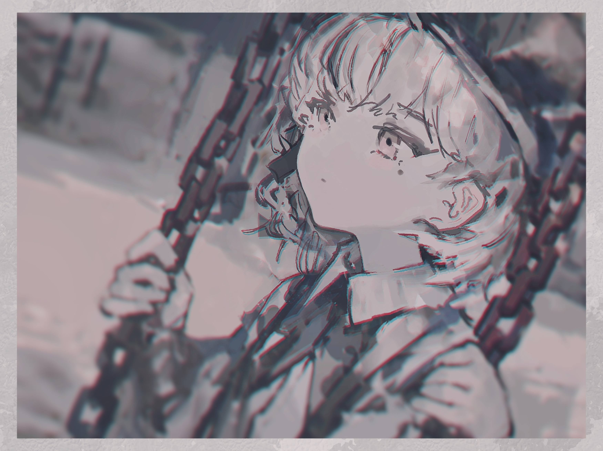

# 「Sometimes」 `EN#235`

---

> [[2024-05-18|18/05/24]]
> #poetry 
> #poetry/art 
> #language/english 
> #poetry/type/free-verse 
> #poetry/rhymed/🔴 
> #poetry/rating/⭐⭐⭐ 
> #longing #loss #despair #regret #isolation #melancholy #introspection #bittersweet #futility #resignation #depressive #desire #sadness #pain #existential #cynical #disappointing-reality #lost #overthinking 

---

---

Sometimes I still wait
For you to tell me about your day
Because I forget 
We haven't talked for a long time

Sometimes I'd like to hear you laugh
But now it'd seem fake
It all feels like a dream
And I want to go back to sleep

Sometimes I wonder
If we were ever really friends
Or if we only thought that 
Because we had nothing better left