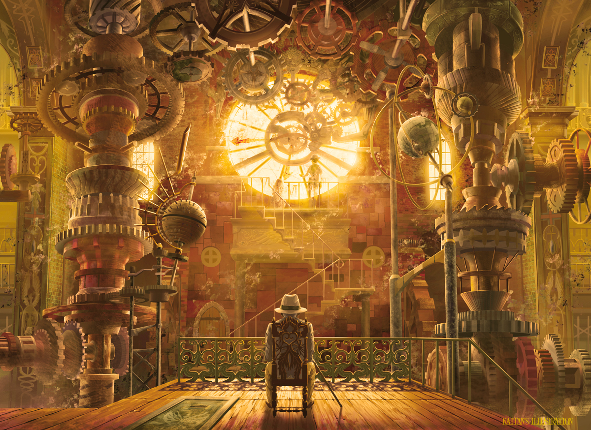

# 「꧁🆃🅸🅼🅴꧂」 `EN#003`
 

---

> 02/01/22
> 
> #poetry 
> #language/english 
> #poetry/type/free-verse 
> #poetry/rhymed/🔴 
> #poetry/rating/⭐⭐⭐ 
> #abstract #cosmic #eldritch #existential #fiction #futility #mystery #overthinking #parable #paradoxical #scary #story 

---

<a href="https://www.pixiv.net/en/artworks/45250269" class="source-link">source: pixiv</a>

---

What's 🆃🅸🅼🅴 but an illusion?
Created by 𝔅𝔢𝔦𝔫𝔤𝔰 hungry
For 𝘔𝘰𝘯𝘦𝘺 and 𝘍𝘢𝘮𝘦.
"But shouldn't it have been
already exposed? It's 𝙤𝙗𝙫𝙞𝙤𝙪𝙨!"
That is the job of the
𝕋𝕚𝕞𝕖𝕜𝕖𝕖𝕡𝕖𝕣𝕤.
Being made of pure energy,
Older than Ｔｈｅ Ｕｎｉｖｅｒｓｅ,
Forced to nefariocity.
Their task is to keep
Everyone in check,
To fine tune
The ᴄʟᴏᴄᴋᴡᴏʀᴋ of Ｔｈｅ Ｕｎｉｖｅｒｓｅ,
Manipulate every and each
Of the particles and forces
In Ｔｈｅ Ｕｎｉｖｅｒｓｅ,
To make it seem
Like 🆃🅸🅼🅴 exists.
So that no one could ever
Have proof it is otherwise.

---

!../!art/EvoZ - Timekeeper.mp3