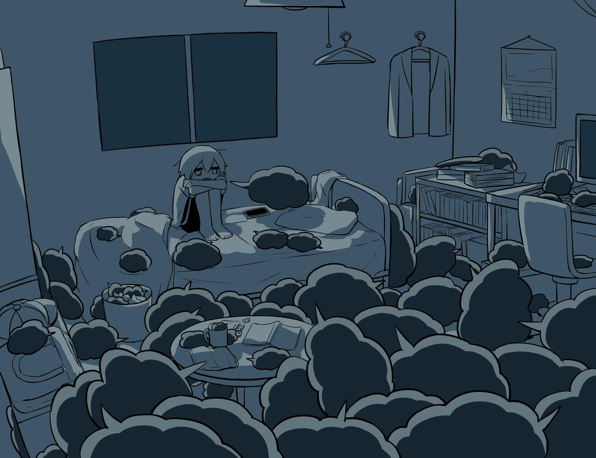

# 「Wool」 `EN#266`

---

> [[2024-09-29|29/09/24]]
> 
> #poetry 
> #language/english 
> #poetry/type/free-verse #poetry/type/septet #poetry/type/short 
> #poetry/rhymed/🔴 
> #poetry/rating/⭐⭐⭐ 
> #dark #melancholy #eldritch #duality #depressive #sadness #existential #introspection #insanity #isolation 

---

Baa, baa, black sheep  
Have you any wool  
Yes sir, yes sir, three bags full  
And some black thoughts too  
One for you  
One for what's under the bed  
And one for the void in your heart too