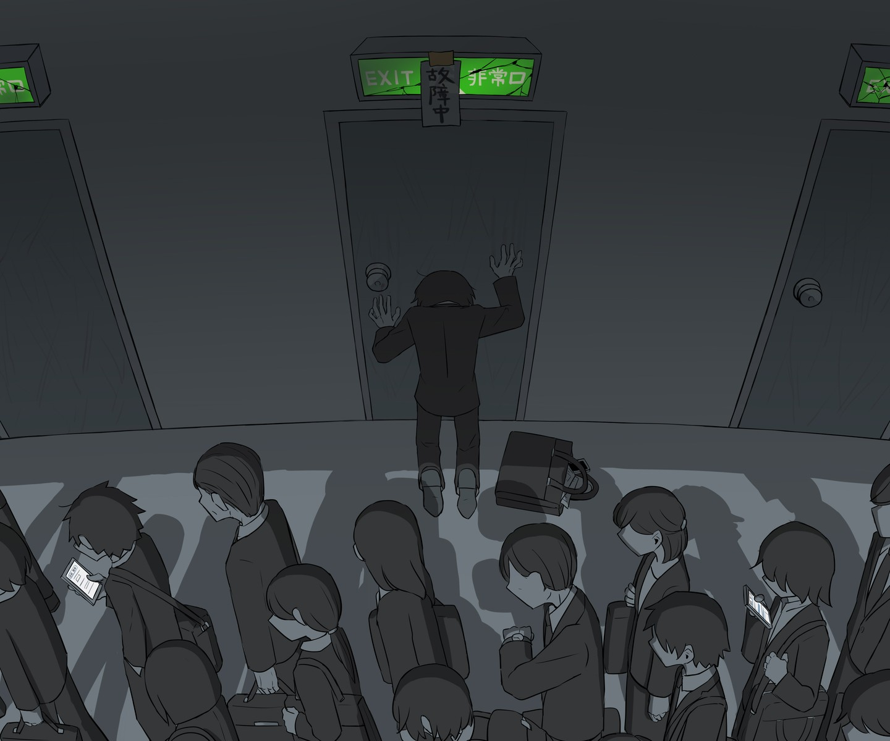

# 「Wyjście awaryjne」 `PL#099`

---

> 28/11/23
> 
> #poetry 
> #language/polish
> #poetry/type/free-verse 
> #poetry/rhymed/🟡 
> #poetry/rating/✨✨✨✨✨ 
> #isolation #despair #fear #futility #trapped #frustration #regret #sadness #introspection #depressive #resignation #longing #dark #existential #disappointing-reality 

---

<a href="https://www.avogado6.com/diary2021?lightbox=dataItem-kz8enu55" class="source-link">source: avogado6</a>

---

Zamknięty w białej klatce
Wydostać nie mogę się
Zamknęli mnie tu nie ludzie
Lecz moje ciało zdradziło mnie

Ręce związane mam
Nie chciałem wdepnąć w ten szlam
Lecz wszechświat w kości gra
I przegrana moja ręka

Waliłbym pięścią w drzwi
Gdybym tylko znaleźć mógł je
Gardło zdarte już mam
Dłużej krzyczeć już nie mogę

Czasem ściany zbliżać zdają się
Paranoja dopada już mnie
Słyszę bicie mojego serca
Coraz cichsze wydaje się

Nie marzę o niczym innym
Tylko życie normalne wieść
Lecz z każdym dniem tracę nadzieję
Że kiedykolwiek ono spełni się