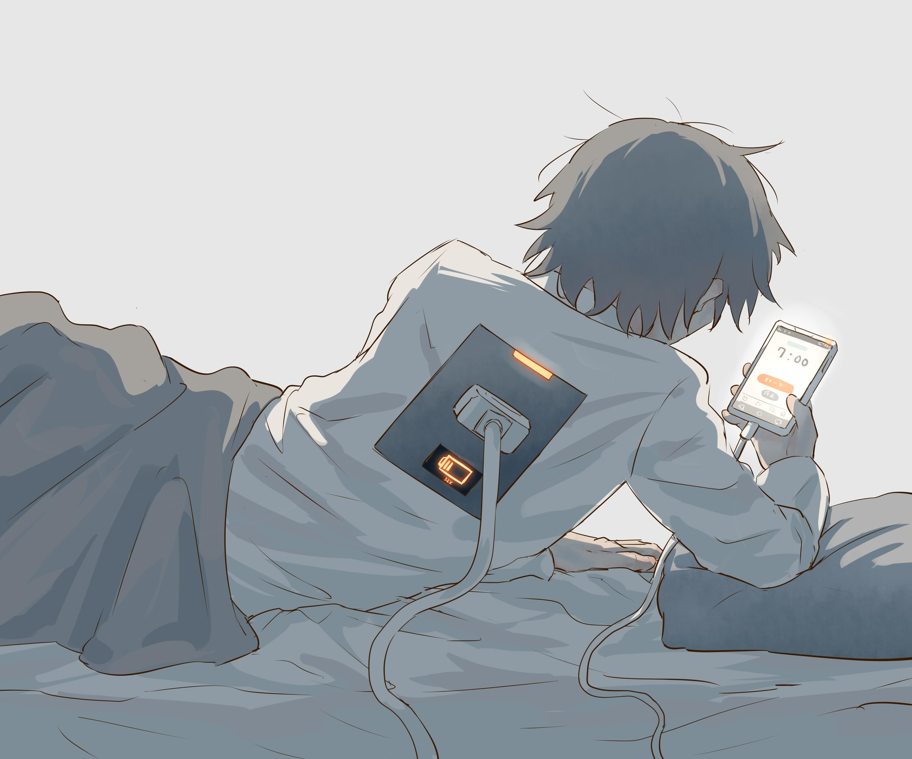

# 「charging」 `EN#295`

---

> 24/11/24
> 
> #poetry 
> #language/english 
> #poetry/type/free-verse 
> #poetry/rhymed/🔴 
> #poetry/rating/⭐⭐⭐⭐ 
> #despair #futility #isolation #frustration #chaos #existential #melancholy #introspection #trapped #betrayal #depressive #sadness #change #pain #rejection #resignation #weird #disappointing-reality #insanity #lost #whimsical 

---

---

*bloop*
low battery
please don't disconnect your charger
battery at 3%, charging...
update in progress
please don't turn off your device

update failed
reverting changes
\[error]: could not revert changes 
performing device reset
do you want to keep you files? [Y/y]
n
unknown value
please use [Y/y]
y
we'll keep your files 

reset complete
sign in
username: endme
password: 5t0pth15h3ll
welcome back