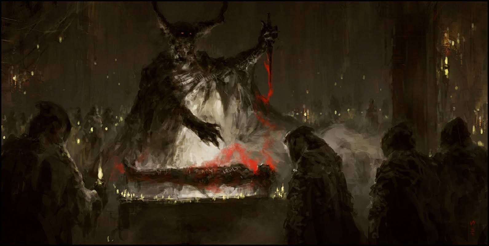

# 「name」 `EN#000`

---

> 01/01/70
>  
> #poetry
> #language
> #poetry/type
> #poetry/rhymed
> #poetry/rating
> keywords

---

image

<a href="https://" class="source-link">Source: </a>

---

26/04/25
#language/multilingual 

rip my heart out 

put it on display

make me a sacrifice

on a crimson tray

flay me open

devour my entrails

drain my blood out

give it them to share 

  

my life is yours

my soul is long gone

use how you see fit

there is no answer wrong

waste not a drop of blood 

not that I could care

I promise not to scream

so

  

cut me, skin me

feed me to the sun

  
  

28/04/25

  
  

arrache mon cœur

en faire un spectacle

fais de moi un sacrifice

sur un plateau cramoisi

écorche-moi sur l'autel

dévore mes entrailles

vide tout de mon sang

donne-leur à partager

  

ma vie est à toi

mon âme est déjà partie

utilise-le comme il te plaît

il n'y a pas de mauvaise réponse

ne gaspille pas une goutte de sang

même si je ne fais pas attention

je promets de ne pas crier

donc

  

coupe-moi, écorche-moi

donne-moi au soleil

  
  

26/04/25

  

wyrwij ze mnie serce

wyssij z kości szpik

rozpłataj na ołtarzu

rozlej moją krew 

zapoluj na mą duszę

zapomnij co to grzech

ulegnij swym kaprysom

utul moje łzy

  

me życie w twych rękach 

dusza dawno zaschła

zrób ze mną co myślisz

nie ważne jak to sprośne

nie zmarnuj ani kropli

choć ja się tym nie przejmę 

nauczony jestem milczeć

więc

  

szlachtuj, skóruj

podaruj mnie słońcu

  

ᚠᛁᛞ ᛗᛁ ᛏᚢ ᚦᛖ ᛊᚨᚾ

05/05/25

  

ᚱᛇᛈ ᛗᚨᛃ ᚺᚨᚱᛏ ᚨᚹᛏ

ᛈᚢᛏ ᛇᛏ ᛟᚾ ᛞᛇᛊᛈᛚᛖᛃ

ᛗᛖᛃᚲ ᛗᛁ ᚨ ᛊᚨᚲᚱᛇᚠᚨᛃᛊ

ᛟᚾ ᚨ ᚲᚱᛇᛗᛉᛟᚾ ᛏᛊᚺᚱᛖᛃ

ᚠᛚᛖᛃ ᛗᛁ ᛟᚹᛈᛖᚾ

ᛞᛖᚠᚨᚹᚱ ᛗᚨᛃ ᛖᚾᛏᛊᚺᚱᛖᛃᛚᛊ

ᛞᛉᚺᚱᛖᛃᚾ ᛗᚨᛃ ᛒᛚᚨᛞ ᚨᚹᛏ

ᚷᛇᚠ ᛇᛏ ᚦᛖᛗ ᛏᚢ ᛊᚺᛖᚱ

  

ᛗᚨᛃ ᛚᚨᛃᚠ ᛇᛊ ᛃᛟᚱᛊ

ᛗᚨᛃ ᛊᛟᛚ ᛇᛊ ᛚᛟᛜ ᚷᛟᚾ

ᛃᚢᛉ ᚺᚨᚹ ᛃᚢ ᛊᛁ ᚠᛇᛏ

ᚦᛖᚱ ᛇᛊ ᚾᛟᚹ ᚨᚾᛊᛖᚱ ᚱᛟᛜ

ᚹᛖᛃᛊᛏ ᚾᛟᛏ ᚨ ᛞᚱᛟᛈ ᛟᚠ ᛒᛚᚨᛞ

ᚾᛟᛏ ᚦᚨᛏ ᚨᛃ ᚲᚢᛞ ᚲᛖᚱ

ᚨᛃ ᛈᚱᛟᛗᛇᛊ ᚾᛟᛏ ᛏᚢ ᛊᚲᚱᛁᛗ

ᛊᛟᚹ

  

ᚲᚨᛏ ᛗᛁ, ᛊᚲᛇᚾ ᛗᛁ

ᚠᛁᛞ ᛗᛁ ᛏᚢ ᚦᛖ ᛊᚨᚾ