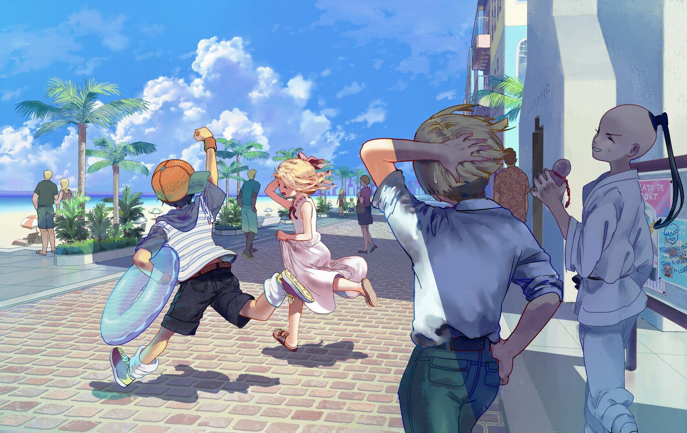

# 「fool」 `EN#133`

---

> [[2023-01-14|14/01/23]]
> 
> #poetry 
> #songs 
> #language/english 
> #poetry/type/free-verse 
> #poetry/rhymed/🟡 
> #poetry/rating/⭐⭐⭐⭐ 
> #love #rejection #isolation #regret #youth #bittersweet #depressive #loss

---

<a href="https://www.pixiv.net/en/artworks/31677325" class="source-link">source: pixiv</a>

---
Capo1
we were kids - A
young and carefree - D
biking down the street A D

every winter a snowball fight A D
with the rest of the neighborhood F A

hanging out in the woods A D
in our secret spot A D

watching the sunrise together A D
our first kiss F E

I thought it would last forever A D
but I was a fool f e             - change to minor tonation

you left without looking back
without a word you left
to explore the world

and I stayed
too scared to go with you
too scared to hold on to you

now I'm still here with everyone else
still broken
still hurt
still waiting for you
maybe you're still the same
maybe we will be together again
but I'm probably still a fool