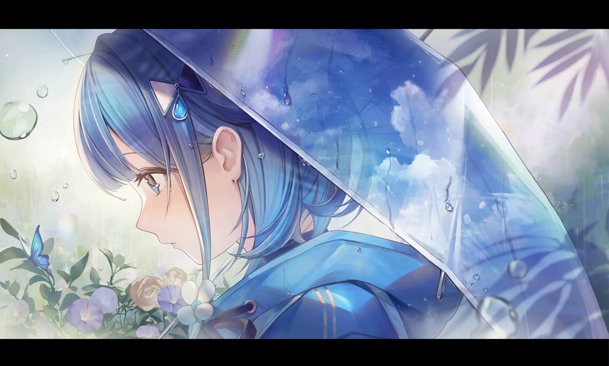

# 「let's never meet again」 `EN#252`

---

> 02/09/24
> 
> #poetry 
> #language/english 
> #poetry/type/free-verse 
> #poetry/rhymed/🔴 
> #poetry/rating/✨✨✨✨✨ 
> #longing #bittersweet #melancholy #regret #loss #resignation #nostalgia #depressive #guilt #love #sadness #pain #wisdom #determination #ephemerality #introspection #overthinking 

---

let’s never meet again—  
not in the quiet spaces  
where memories rest like dust  
or in dreams that wake us  
with echoes of what once was us  
  
let’s not cross paths  
on the pages of old letters  
in whispered words  
or the crumbling bridges  
that we burned to nothing but embers  
  
let’s not see each other  
in strangers' faces or  
in moments when the air grows still  
bringing with it the scent of your perfume  
that lingers longer than it should  
  
let’s never meet again—  
it’s better this way  
to stay as memories untangled, repressed  
as hearts that might heal in due time  
as strangers who once danced together,  
yet separate somehow