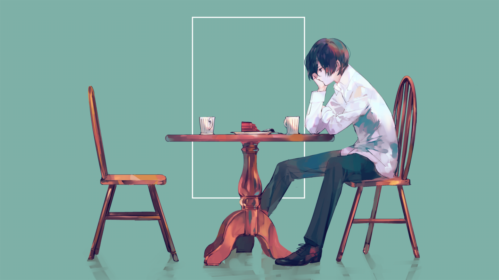

# 「mauerbauertraurigkeit」 `EN#211`

---

> [[2023-11-19|19/12/23]]
> 
> #poetry 
> #language/english 
> #poetry/type/free-verse 
> #poetry/rhymed/🔴 
> #poetry/rating/✨✨✨✨✨ 
> #isolation #fear #despair #sadness #frustration #guilt #betrayal #depressive #longing #futility #pain #rejection #resignation #existential #determination #disappointing-reality #overthinking #trapped 

---

https://wallhaven.cc/w/96krxw

---

I need to be alone
no one can touch me
no one can know me
no one can help me

don't get close
you will get hurt
at least I think so —
I'm not taking any chances

leave me be
it's for the better
you won't help
and I won't get better

don't talk to me
I won't respond
or I'll bark something back
I have to be alone so no one gets hurt