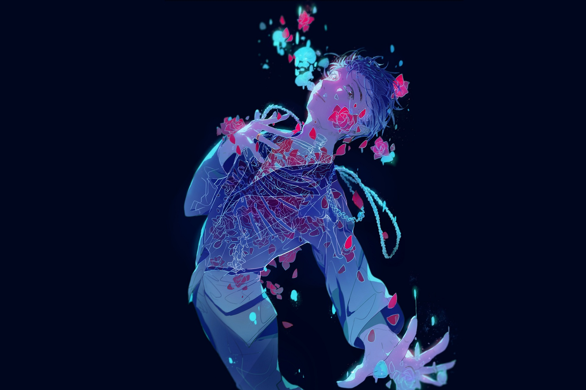

# 「modlitwa do gwiazd」 `PL#101`

---

> 09/01/24
> 
> #poetry 
> #language/polish
> #poetry/type/free-verse 
> #poetry/rhymed/🔴 
> #poetry/rating/✨✨✨✨✨ 
> #despair #isolation #death #melancholy #existential #futility #trapped #resignation #cathartic #desire #longing #dark #cosmic #introspection 

---

https://wallhaven.cc/w/pklrrj

---

usta skute lodem
szepczą modlitwę
do mrożnego wiatru
oczy zmęczone
wśród gwiazd
szukają odpowiedzi
nade mną kasjopeja
przede mną orion
gdzieś tam voyager leci
w otchłań
na spotkanie śmierci
w płucach ogień metanolu
niech spłonę w nim
mróz niech skuje kości