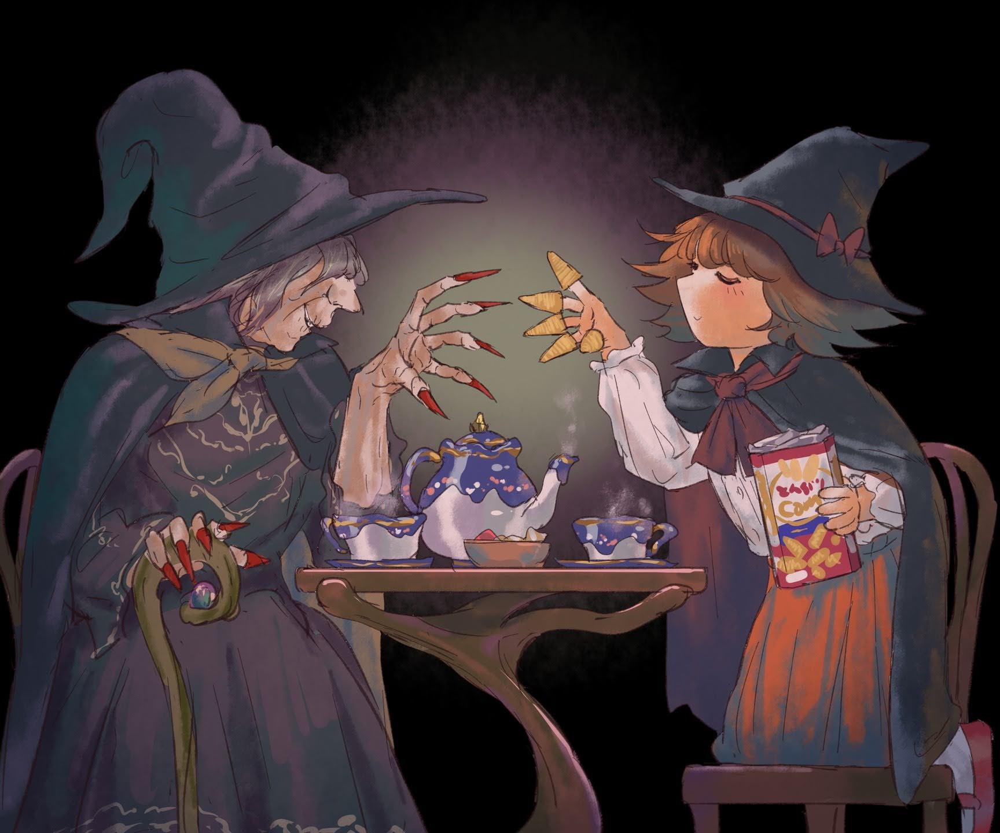

# 「name」 `EN#000`

---

> 01/01/70
>  
> #poetry
> #language
> #poetry/type
> #poetry/rhymed
> #poetry/rating
> keywords

---

image

<a href="https://" class="source-link">Source: </a>

---

31/10/24

w blasku lampy i cieniu nocy

przy stoliku gdzie czarują niecnoty

w ciszy i spokoju siedzą dwie wiedźmy

z różdżką za pasem i herbatą w dłoni

  

stara jak czas, o szponach rubinowych

wplata słowa zaklęć w każdy łyk gorący

a młoda z sercem głodnym tajemnic

chrupie radośnie ciasteczka obietnic

  

para z filiżanek unosi się lekko

łącząc przeszłość i przyszłość w jedno

w słodkiej przerwie od mocy i czarów

dwie wiedźmy nie liczą czasu

  

czy to mądrość starszej, czy uśmiech młodej

magia tkwi w herbacie, nie w czarach i mowie

bo choć czary wielkie przynoszą zdumienie

wszystko przebije herbaty wzdechnienie