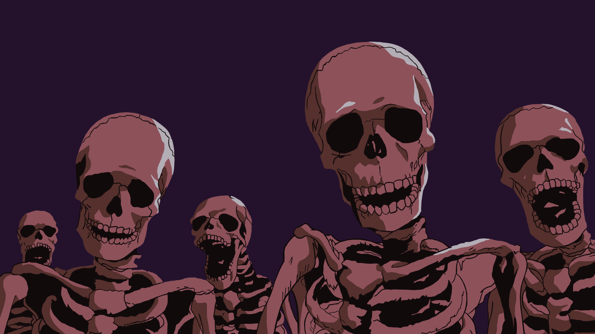

# 「the dead never sleep, they just wait for you to forget them」 `EN#301`

---

> [[2024-12-04|04/12/24]]
> 
> #poetry 
> #language/english 
> #poetry/type/free-verse 
> #poetry/rhymed/🔴 
> #poetry/rating/✨✨✨✨✨ 
> #death #loss #isolation #despair #nostalgia #melancholy #existential #bittersweet #whimsical #frustration #hopeful #longing #sadness #humanity #social-commentary #weird #futility #lost #thought-provoking #trapped 

---

https://wallhaven.cc/w/l3ovyy

From: Berserk

---

beneath the soil, there silence dwells
a chorus rises, it’s singing in the whole village heard
bony fingers grasping at dirt
waiting for memory to finally set them free

the skeletons, while brittle, stand strong
in unison they sing — in plea, in woe
a requiem for their own souls
“the dead never sleep, the living forget not”

each whispered name, a fragile thread
binding the living to the restless dead
will you forget them and let them rest?
or will you remember and listen to the ghastly choir?