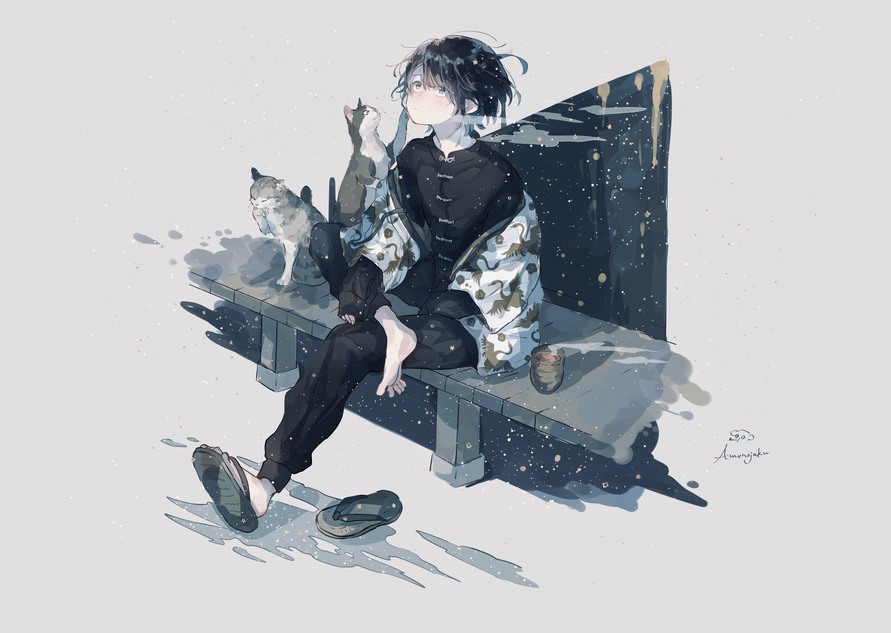

# 「winter's caress」 `EN#210`

---

> 19/12/23
> 
> #poetry 
> #language/english 
> #poetry/type/free-verse #poetry/type/short 
> #poetry/rhymed/🟡 
> #poetry/rating/⭐⭐⭐⭐ 
> #tranquility #comfort #melancholy #wisdom #isolation #nature #existential #uplifting 

---

https://wallhaven.cc/w/pkkr2j

---

in winter's gentle embrace a chill takes hold
snowflakes weave in silence tales untold
the snowy embrace warms my heart
while the tales occupy my everworking mind

a cup of tea
a slice of peace
a blanket of warmth
is all I need