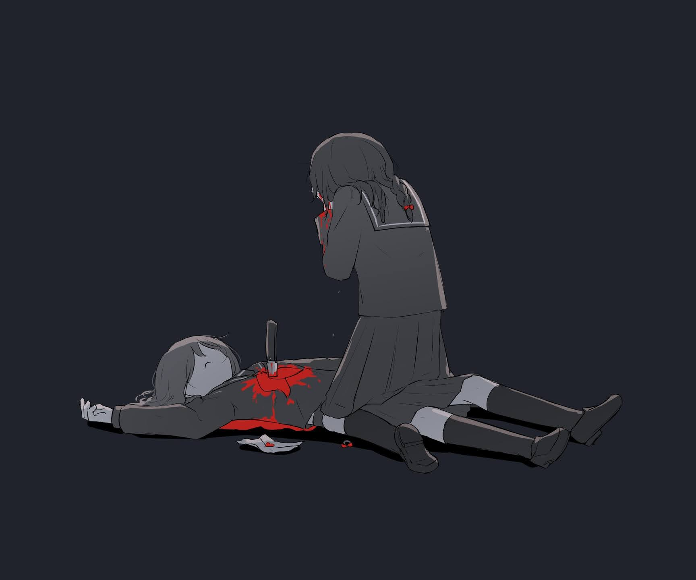

# 「脈なし」 `EN#266`
## “Just friends” / “No pulse”

---

> [[2024-10-04|04/10/24]]
> 
> #poetry 
> #language/english 
> #poetry/type/free-verse #poetry/type/decastich #poetry/type/short 
> #poetry/rhymed/🔴 
> #poetry/rating/⭐⭐⭐ 
> #love #rejection #despair #guilt #loss #resignation #isolation #frustration #sadness #trapped #pain #existential #fate #disappointing-reality #futility #introspection 

---

---

I'm sorry  
I can't love you  
I'm sorry  
We can't be together  
They said I would find love  
But I can't  
And I just keep hurting people  
And I just keep hurting myself  
This has to stop  
I have to accept what can't be changed