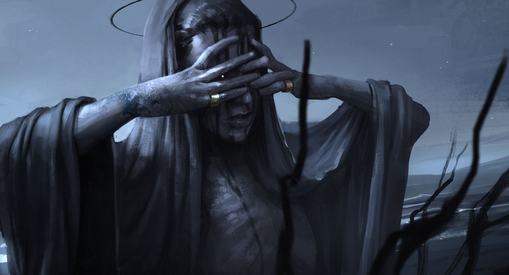

# 「Execution」 `EN#188`

---

> 18/09/23
> 
> #poetry 
> #language/english 
> #poetry/type/free-verse #poetry/type/quatrain #poetry/type/short 
> #poetry/rhymed/🟡 
> #poetry/rating/⭐⭐⭐ 
> #dark #apocalypse #existential #scary #betrayal #wrath #death #eldritch #humanity #mystery #futility 

---

https://wallhaven.cc/w/8xmd6k

---

Execution of mankind
Deep in the night
Vague shapes moving
Insanity's in sight