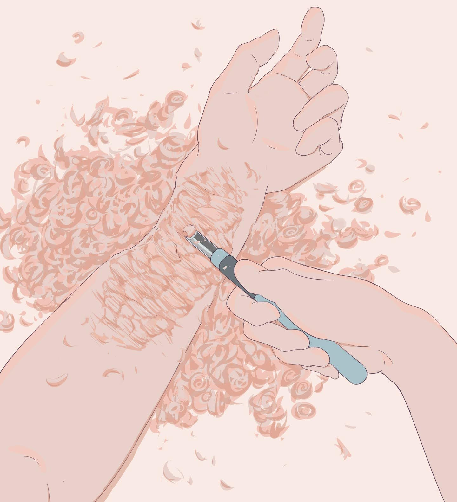

# 「My leftovers」 `EN#231`

---

> 04/05/24
> 
> #poetry 
> #poetry/art 
> #language/english 
> #poetry/type/free-verse 
> #poetry/rhymed/🔴 
> #poetry/rating/✨✨✨✨✨ 
> #gods #betrayal #desire #frustration #regret #resilience #cathartic #introspection #existential #loss #wrath #depressive #despair #determination #humanity #social-commentary #pain #rejection #revenge #dark #profanity #cynical #insanity #isolation 

---

---

They wanted me to change
So I'm changing
One chip at a time
I will carve out of myself a better being
Even in worst materials parts can be beautiful
I'll get to them one way or another
And I will bring them out for all to see
All the chips I'll send back to God
Asking for a refund even though I
Left the best parts for myself
He knows what he did and the price he'll pay