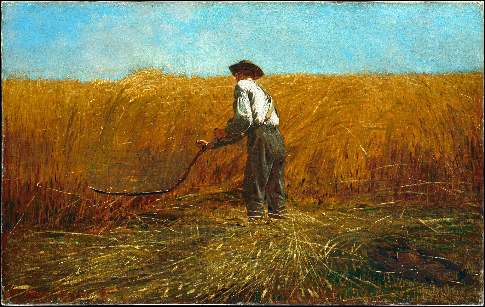

# 「Scripture」 `EN#240`

---

> 21/05/24
> 
> #poetry 
> #poetry/art 
> #language/english 
> #poetry/type/free-verse 
> #poetry/rhymed/🟡 
> #dark #thought-provoking #death #gods #parable 

---

---

Your life has ended
Now pay the toll
The sower reaps
What he has sown

When harvest comes
Please settle the bill
The teacher thanks
The child who learn will

When Death comes
Please listen well
Look in the verses
See what they tell