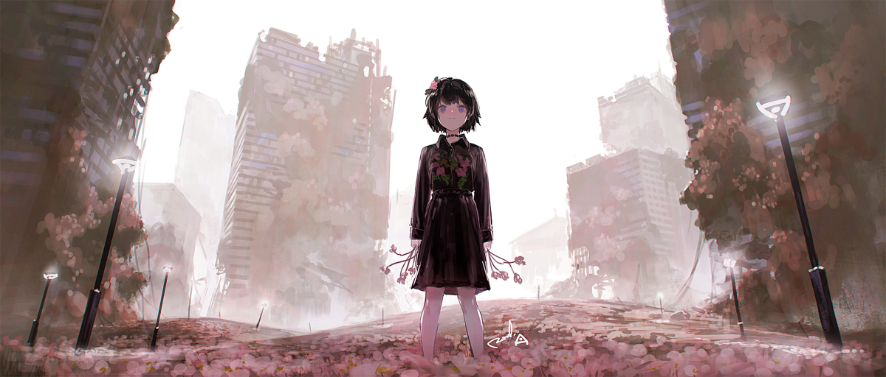

# 「Traipse」 `EN#136`

---

> 30/01/23
> 
> #poetry 
> #language/english 
> #poetry/type/free-verse 
> #poetry/rhymed/🟡 
> #poetry/rating/⭐⭐⭐⭐ 
> #sadness #melancholy #humanity #apocalypse #isolation #bittersweet #loss 

---

<a href="https://www.pixiv.net/en/artworks/70331181" class="source-link">source: pixiv</a>

---

Walking through ruins,
Finding memories once lost
To the depths of time,
Like letters in a ghost town's post.

Putting together pieces.
Doing rounds through the rubble,
Where critters made homes,
To find just trouble.

Kicking up clouds of thick dust,
Tripping on a left behind,
Family portrait,
Now left unentwined.