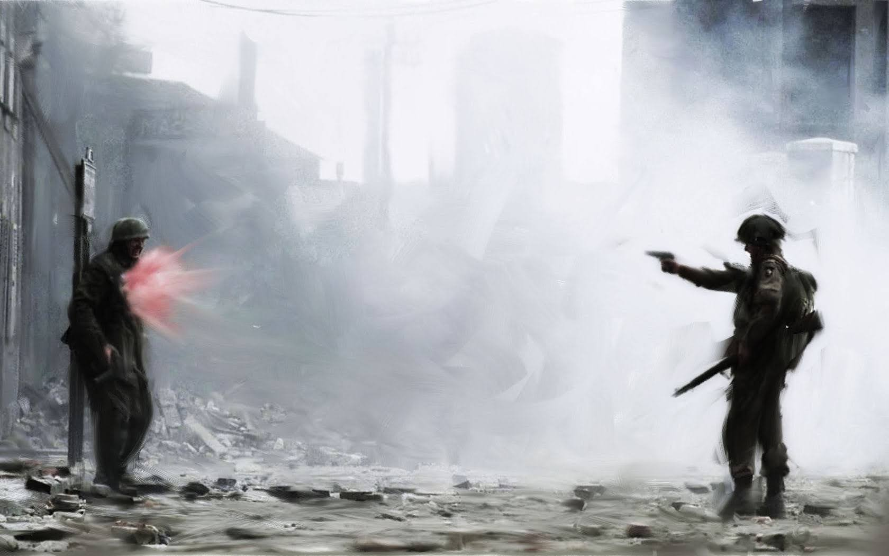

# 「Victory」 `EN#050`

---

> 09/06/22
> 
> #poetry 
> #language/english 
> #poetry/type/free-verse 
> #poetry/rhymed/🔴 
> #poetry/rating/✨✨✨✨✨ 
> #cynical #death #depressive #disappointing-reality #existential #frustration #futility #grief #humanity #paradoxical #rebellion #social-commentary #violence 

---

---

> If by the Victory all we mean is a broken and brooding foe;
Is the pomp and power of a glitt'ring hour, and a truce for an age or so.
By the clay-cold hand on the broken blade we have smitten a bootless blow!
— Robert William Service "The Song Of The Pacifist"

What for are all the wars?
What for a single victory?
What does it show to others?
That our sword is sharper?

Why are piles of dead
A sign of success?
Why are mothers' howls
A triumphant fanfare?

Is the greatest honour
To be drenched in foe's blood?
Is our mind too weak
To create a better route?

And when time comes
For another bloody war
We stand next to our former foe
Isn't that somewhat —
                  Hypocritical?