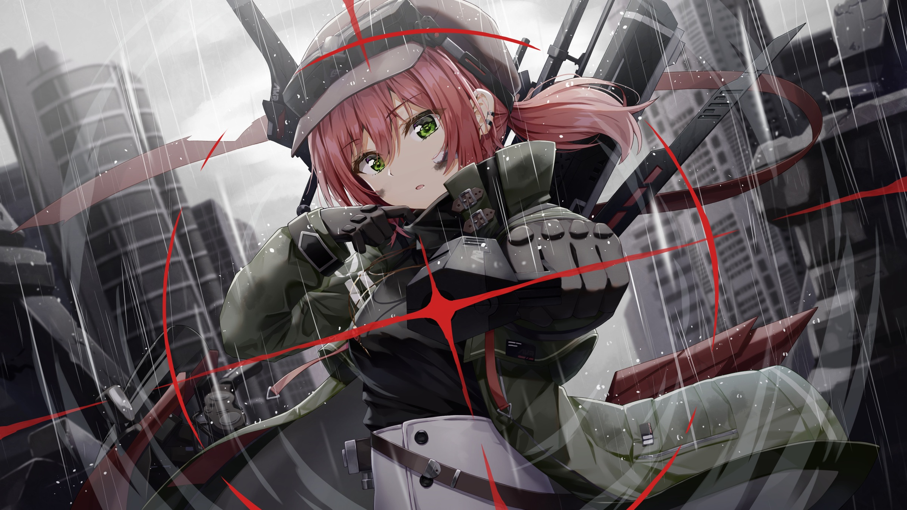

# 「Wish」 `EN#177`

---

> 29/07/23
> 
> #poetry 
> #poetry/art 
> #poetry/music 
> #language/english 
> #poetry/type/free-verse 
> #poetry/rhymed/🔴 
> #poetry/rating/⭐⭐⭐⭐ 
> #pain #regret #isolation #depressive #dark #despair #disappointing-reality #existential #frustration #futility #humanity #longing #resignation #sadness #trapped 

---

---

Sometimes I wish I could lend you my eyes
So you could see what I cannot unsee
Sometimes I wish I could lend you my arms and my calfs
So you could feel just how much they can burn
Sometimes I wish I could become someone else
So I could forget of the pain

Lucky are those who live unaware
Who can close their eyes for all the wrong
Lucky are those who live unaware
Who don't know all the things I know

Sometimes I wish I could lend you my voice
So you could hear how it aches
Sometimes I wish I could lend you my heart
So you could feel the agony it exerts
Sometimes I wish I could lend you my brain
So I could never take it back again

Unlucky me who has to live with themselves
Who can do nothing to feel less pain
Unlucky me who has to live with themselves
Who can never be like the norm

Sometimes I wish a saviour would come
Save me and the world
But they won't
They never ever survive

---

Listen to: Tikkle Me - Blow My Brains Out